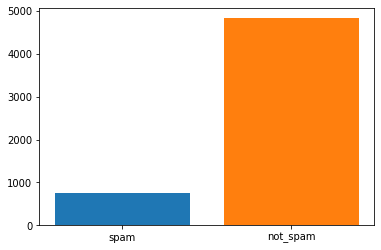
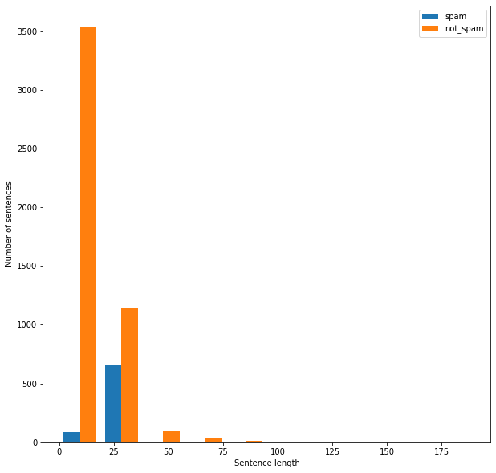
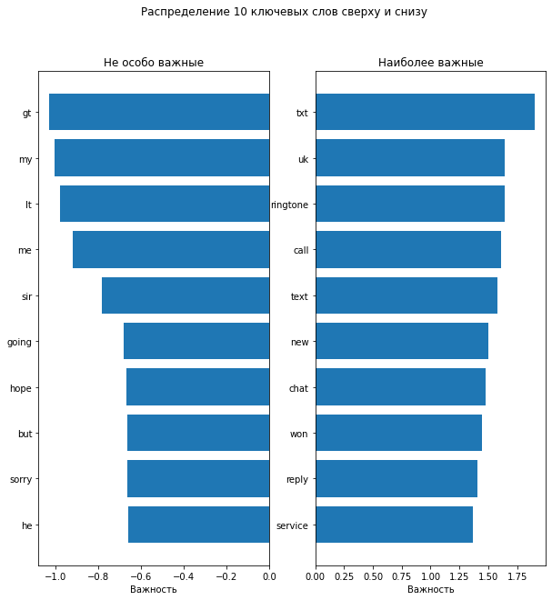
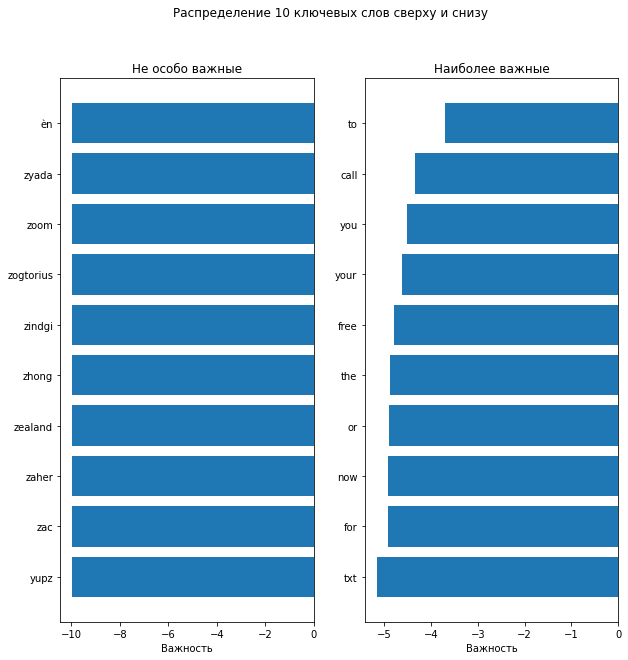

[:arrow_down: TO_RESULTS](#Results)


## Файл SpamClassification.ipynb ([ссылочка на него](https://github.com/in7erval/AIUS/blob/check-spam/SpamClassification/SpamClassification.ipynb))

Читаем файл


```python
with open('SMSSpamCollection.txt') as f:
  file_lines = f.readlines()
print(f"Line's count: {len(file_lines)}")
```

    Line's count: 5574


Парсим строки


```python
SPAM = 'spam'
NOT_SPAM = 'not_spam'
parsed_lines = {SPAM: [], NOT_SPAM: []}
for line in file_lines:
  splitted_line = line.split(maxsplit=1)
  key = splitted_line[0] if splitted_line[0] != 'ham' else NOT_SPAM # хз что такое ham, меняем на not_spam
  value = splitted_line[1].replace('\n', ' ').replace('\t', ' ')
  parsed_lines[key].append(value) # будем надеяться, что со строчками всё ок и сделаем так ^_^
print(f"Check that parsed_lines containts only SPAM and NOT_SPAM: parsed_lines.keys() = {parsed_lines.keys()}")
print(f"Spam message's count: {len(parsed_lines['spam'])}\nNot spam message's count: {len(parsed_lines['not_spam'])}")
print(f"Spam example: \"{parsed_lines['spam'][0]}\"\nNot spam ex: \"{parsed_lines['not_spam'][0]}\"")
```

    Check that parsed_lines containts only SPAM and NOT_SPAM: parsed_lines.keys() = dict_keys(['spam', 'not_spam'])
    Spam message's count: 747
    Not spam message's count: 4827
    Spam example: "Free entry in 2 a wkly comp to win FA Cup final tkts 21st May 2005. Text FA to 87121 to receive entry question(std txt rate)T&C's apply 08452810075over18's "
    Not spam ex: "Go until jurong point, crazy.. Available only in bugis n great world la e buffet... Cine there got amore wat... "


Красивый графичек с отношением количества спама к количеству не спама


```python
import matplotlib.pyplot as plt

fig = plt.figure()
plt.bar(SPAM, len(parsed_lines[SPAM]))
plt.bar(NOT_SPAM, len(parsed_lines[NOT_SPAM]))
plt.show()
```





Используем pandas, чтобы удобно смотреть данные


```python
import pandas as pd
LABEL = 'label'
MSG = 'message'
```

Объединяем dict parsed_lines, чтобы записать в таблицу. Паралелльно чистим текст


```python
def clean_text(text):
    return text.replace(r"http\S+", "") \
      .replace(r"http", "") \
      .replace(r"@\S+", "") \
      .replace(r"[^A-Za-z0-9(),!?@\'\`\"\_\n]", " ") \
      .replace(r"@", "at").lower()

import random
data_table = []
for spam_line in parsed_lines[SPAM]:
  data_table.append({LABEL: SPAM, MSG: clean_text(spam_line)})
for not_spam_line in parsed_lines[NOT_SPAM]:
  data_table.append({LABEL: NOT_SPAM, MSG: clean_text(not_spam_line)})
random.shuffle(data_table)
```


```python
df = pd.DataFrame(data_table)
df
```


<div>
<table border="1">
  <thead>
    <tr style="text-align: right;">
      <th></th>
      <th>label</th>
      <th>message</th>
    </tr>
  </thead>
  <tbody>
    <tr>
      <th>0</th>
      <td>not_spam</td>
      <td>also tell him i said happy birthday</td>
    </tr>
    <tr>
      <th>1</th>
      <td>not_spam</td>
      <td>hi. i'm sorry i missed your call. can you pls ...</td>
    </tr>
    <tr>
      <th>2</th>
      <td>not_spam</td>
      <td>ill call u 2mrw at ninish, with my address tha...</td>
    </tr>
    <tr>
      <th>3</th>
      <td>not_spam</td>
      <td>i called but no one pick up e phone. i ask bot...</td>
    </tr>
    <tr>
      <th>4</th>
      <td>not_spam</td>
      <td>arun can u transfr me d amt</td>
    </tr>
    <tr>
      <th>...</th>
      <td>...</td>
      <td>...</td>
    </tr>
    <tr>
      <th>5569</th>
      <td>not_spam</td>
      <td>oh that was a forwarded message. i thought you...</td>
    </tr>
    <tr>
      <th>5570</th>
      <td>not_spam</td>
      <td>ron say fri leh. n he said ding tai feng cant ...</td>
    </tr>
    <tr>
      <th>5571</th>
      <td>not_spam</td>
      <td>i'm sick !! i'm needy !! i want you !! *pouts*...</td>
    </tr>
    <tr>
      <th>5572</th>
      <td>not_spam</td>
      <td>cthen i thk shd b enuff.. still got conclusion...</td>
    </tr>
    <tr>
      <th>5573</th>
      <td>not_spam</td>
      <td>where in abj are you serving. are you staying ...</td>
    </tr>
  </tbody>
</table>
<p>5574 rows × 2 columns</p>
</div>


```python
df.groupby(LABEL).count()
```


<div>
<table border="1">
  <thead>
    <tr style="text-align: right;">
      <th></th>
      <th>message</th>
    </tr>
    <tr>
      <th>label</th>
      <th></th>
    </tr>
  </thead>
  <tbody>
    <tr>
      <th>not_spam</th>
      <td>4827</td>
    </tr>
    <tr>
      <th>spam</th>
      <td>747</td>
    </tr>
  </tbody>
</table>
</div>


Токенизируем текст


```python
from nltk.tokenize import RegexpTokenizer

TOKENS = 'tokens'
tokenizer = RegexpTokenizer(r'\w+')

df[TOKENS] = df[MSG].apply(tokenizer.tokenize)
df.head()
```


<div>
<table border="1">
  <thead>
    <tr style="text-align: right;">
      <th></th>
      <th>label</th>
      <th>message</th>
      <th>tokens</th>
    </tr>
  </thead>
  <tbody>
    <tr>
      <th>0</th>
      <td>not_spam</td>
      <td>also tell him i said happy birthday</td>
      <td>[also, tell, him, i, said, happy, birthday]</td>
    </tr>
    <tr>
      <th>1</th>
      <td>not_spam</td>
      <td>hi. i'm sorry i missed your call. can you pls ...</td>
      <td>[hi, i, m, sorry, i, missed, your, call, can, ...</td>
    </tr>
    <tr>
      <th>2</th>
      <td>not_spam</td>
      <td>ill call u 2mrw at ninish, with my address tha...</td>
      <td>[ill, call, u, 2mrw, at, ninish, with, my, add...</td>
    </tr>
    <tr>
      <th>3</th>
      <td>not_spam</td>
      <td>i called but no one pick up e phone. i ask bot...</td>
      <td>[i, called, but, no, one, pick, up, e, phone, ...</td>
    </tr>
    <tr>
      <th>4</th>
      <td>not_spam</td>
      <td>arun can u transfr me d amt</td>
      <td>[arun, can, u, transfr, me, d, amt]</td>
    </tr>
  </tbody>
</table>
</div>


Немного больше информации о тексте, а именно длина сообщения


```python
all_words = [word for tokens in df[TOKENS] for word in tokens]
sentence_lengths_spam = [len(tokens) for tokens in df.loc[df[LABEL] == SPAM][TOKENS]]
sentence_lengths_not_spam = [len(tokens) for tokens in df.loc[df[LABEL] == NOT_SPAM][TOKENS]]
VOCAB = sorted(list(set(all_words)))
print("%s words total, with a vocabulary size of %s" % (len(all_words), len(VOCAB)))
print("Max sentence length is %s" % max(max(sentence_lengths), max(sentence_lengths_not_spam)))
```

    90357 words total, with a vocabulary size of 8757
    Max sentence length is 190


Ещё один красивый графичек, красивых графичков много не бывает


```python
fig = plt.figure(figsize=(10, 10)) 
plt.xlabel('Sentence length')
plt.ylabel('Number of sentences')
plt.hist([sentence_lengths_spam, sentence_lengths_not_spam], label=[SPAM, NOT_SPAM])
plt.legend()
plt.show()
```




Как видим большинство сообщений короткие, поэтому трудно сказать, но у спама только короткие

Обычный LabelEncoder сюда не подойдет (ну можно, но сложно), воспользуемся CountVectorizer


```python
from sklearn.model_selection import train_test_split
from sklearn.feature_extraction.text import CountVectorizer

count_vectorizer = CountVectorizer()
```


```python
list_corpus = df[MSG].tolist()
list_labels = df[LABEL].tolist()

X_train, X_test, y_train, y_test = train_test_split(list_corpus, list_labels, test_size=0.2, 
                                                                                random_state=40)

X_train = count_vectorizer.fit_transform(X_train)
X_test = count_vectorizer.transform(X_test)
print(count_vectorizer.vocabulary_)
```
    {'text': 6799, 'pass': 5119, 'to': 6946, '69669': 601, 'collect': 1932, 'your': 7732, 'polyphonic': 5328, 'ringtones': 5812, 'normal': 4854, 'gprs': 3234, 'charges': 1774, 'apply': 1046, 'only': 4973, 'enjoy': 2622, 'tones': 6973, 'yun': 7745, 'ah': 887, 'now': 4873, 'wkg': 7574, 'where': 7499, 'btw': 1574, 'if': 3620, 'go': 3182, 'nus': 4892, 'sc': 5949, 'wana': 7391, 'specialise': 6380, 'in': 3663, 'wad': 7362, 'all': 929, 'done': 2440, 'handed': 3336, 'don': 2438, 'know': 3985, 'mega': 4455, 'shop': 6131, 'asda': 1111, 'counts': 2074, 'as': 1108, 'celebration': 1741, 'but': 1609, 'thats': 6825, 'what': 7488, 'doing': 2429, 'send': 6030, 'logo': 4206, 'ur': 7212, 'lover': 4259, 'names': 4720, 'joined': 3864, 'by': 1623, 'heart': 3403, 'txt': 7105, 'love': 4254, 'name1': 4717, 'name2': 4718, 'mobno': 4577, 'eg': 2568, 'adam': 825, 'eve': 2677, '07123456789': 23, '87077': 707, 'yahoo': 7691, 'pobox36504w45wq': 5302, 'txtno': 7112, 'no': 4825, 'ads': 843, '150p': 310, 'me': 4433, 'not': 4860, 'workin': 7612, 'once': 4967, 'get': 3137, 'job': 3858, 'actually': 823, 'getting': 3145, 'ready': 5617, 'leave': 4087, 'the': 6826, 'house': 3539, 'congrats': 2002, 'mobile': 4572, '3g': 464, 'videophones': 7300, 'yours': 7735, 'call': 1639, '09063458130': 206, 'videochat': 7299, 'wid': 7522, 'mates': 4410, 'play': 5266, 'java': 3825, 'games': 3089, 'dload': 2402, 'polyph': 5327, 'music': 4685, 'noline': 4839, 'rentl': 5725, 'bx420': 1622, 'ip4': 3761, '5we': 573, 'am': 952, 'on': 4963, 'way': 7425, 'tirupur': 6923, 'hi': 3443, 'neva': 4784, 'worry': 7621, 'bout': 1485, 'da': 2174, 'truth': 7069, 'coz': 2084, 'will': 7533, 'lead': 4076, 'it': 3788, 'least': 4085, 'unique': 7170, 'person': 5187, 'like': 4139, 'deserve': 2294, 'sleep': 6236, 'tight': 6904, 'or': 5001, 'morning': 4616, 'msg': 4642, 'office': 4929, 'ok': 4944, 'ask': 1118, 'abt': 779, 'movie': 4632, 'wan': 7389, 'ktv': 4001, 'oso': 5024, 'deep': 2247, 'sigh': 6175, 'miss': 4539, 'you': 7727, 'really': 5625, 'surprised': 6645, 'haven': 3383, 'gone': 3203, 'net': 4777, 'cafe': 1630, 'yet': 7716, 'll': 4187, 'let': 4111, 'when': 7495, 'kicks': 3953, 'lol': 4211, 'have': 3381, 'made': 4334, 'plans': 5263, 'for': 2956, 'new': 4790, 'years': 7704, 'just': 3900, 'decided': 2237, 'eh': 2572, 'are': 1069, 'wet': 7484, 'right': 5804, 'be': 1300, 'receiving': 5644, 'this': 6863, 'week': 7449, 'triple': 7054, 'echo': 2550, 'ringtone': 5810, 'shortly': 6141, 'sun': 6613, 'thk': 6864, 'mayb': 4425, 'can': 1662, 'dun': 2516, 'anythin': 1018, 'book': 1459, 'lesson': 4109, 'pilates': 5238, 'is': 3777, 'at': 1141, 'orchard': 5008, 'mrt': 4640, 'noe': 4829, 'hor': 3521, 'im': 3636, 'sorry': 6344, 'last': 4046, 'nite': 4819, 'wasn': 7407, 'fault': 2805, 'was': 7405, 'spouse': 6427, 'pmt': 5292, 'sumthin': 6612, '4give': 523, 'think': 6855, 'shldxxxx': 6125, 'dear': 2227, 'its': 3795, 'urgnt': 7219, 'whats': 7490, 'problem': 5450, 'want': 7394, 'work': 7610, 'any': 1011, 'other': 5025, 'tell': 6765, 'wating': 7418, 'reply': 5737, 'my': 4696, 'home': 3495, 'went': 7471, 'change': 1762, 'batt': 1281, 'watch': 7411, 'then': 6837, 'bit': 1400, 'lor': 4232, 'good': 3206, 'stuff': 6558, 'do': 2405, 'remember': 5707, 'that': 6823, 'old': 4955, 'commercial': 1956, 'mallika': 4365, 'sherawat': 6105, 'did': 2332, 'yesterday': 7715, 'find': 2870, 'out': 5036, 'lt': 4276, 'url': 7223, 'gt': 3282, 'promise': 5470, 'take': 6702, 'care': 1688, 'of': 4920, 'princess': 5434, 'run': 5877, 'please': 5275, 'pics': 5228, 'chance': 1760, 'ttyl': 7080, 'friendship': 3024, 'poem': 5314, 'near': 4751, 'hear': 3400, 'dont': 2442, 'fear': 2813, 'live': 4179, 'with': 7564, 'cheer': 1801, 'more': 4612, 'tear': 6749, 'always': 950, 'gud': 3287, 'ni8': 4799, 'has': 3368, 'added': 828, 'their': 6830, 'contact': 2018, 'list': 4169, 'www': 7661, 'fullonsms': 3058, 'com': 1941, 'great': 3257, 'place': 5252, 'free': 2999, 'sms': 6280, 'people': 5166, 'visit': 7321, 'asked': 1120, 'money': 4599, 'how': 3542, 'far': 2792, 'summers': 6610, 'finally': 2867, 'here': 3432, 'fancy': 2787, 'chat': 1783, 'flirt': 2914, 'sexy': 6069, 'singles': 6200, 'yr': 7741, 'area': 1070, 'matched': 4407, 'up': 7194, 'summer': 6609, 'join': 3863, 'optout': 5000, 'stop': 6512, 'help08714742804': 3420, 'shall': 6085, 'start': 6464, 'from': 3039, 'ebay': 2548, 'might': 4502, 'less': 4107, 'elsewhere': 2593, 'openings': 4987, 'room': 5839, 'til': 6908, 'after': 868, 'thanksgiving': 6817, 'without': 7567, 'an': 975, 'upcharge': 7196, 'there': 6842, 'thanx': 6820, 'yup': 7749, 'we': 7430, 'coming': 1952, 'back': 1228, 'finish': 2875, 'dinner': 2360, 'going': 3195, 'hotel': 3533, 'time': 6911, 'flies': 2908, 're': 5607, 'tog': 6954, 'exactly': 2709, 'mth': 4655, 'today': 6952, 'hope': 3512, 'haf': 3317, 'many': 4380, 'mths': 4656, 'come': 1946, 'won': 7592, 'guaranteed': 3285, '1000': 259, 'cash': 1711, '2000': 351, 'prize': 5444, 'claim': 1862, 'our': 5033, 'customer': 2159, 'service': 6052, 'representative': 5740, '08714712379': 115, 'between': 1366, '10am': 267, '7pm': 648, 'cost': 2058, '10p': 269, 'well': 7465, 'available': 1186, 'washob': 7406, 'nobbing': 4827, 'night': 4806, 'so': 6297, 'they': 6848, 'had': 3316, 'nickey': 4803, 'platt': 5265, 'instead': 3725, 'why': 7518, 'didnt': 2335, 'holla': 3491, 'yeah': 7702, 'luckily': 4282, 'didn': 2334, 'starring': 6462, 'role': 5832, 'later': 4052, 'short': 6136, 'cute': 2163, 'try': 7070, 'prove': 5490, 'noon': 4845, 'still': 6500, 'plumbers': 5285, 'tape': 6722, 'and': 979, 'wrench': 7636, 'could': 2067, 'borrow': 1474, 'argh': 1076, 'fuck': 3047, 'nobody': 4828, 'town': 7012, 'big': 1380, 'sale': 5905, 'together': 6955, 'road': 5820, 'cant': 1674, 'maybe': 4426, 'westshore': 7483, 'hyde': 3590, 'park': 5108, 'village': 7309, 'yes': 7713, 'innocent': 3710, 'fun': 3060, 'thanks': 6815, 'day': 2214, 'date': 2207, 'sunday': 6615, 'babe': 1219, 'swollen': 6676, 'glands': 3170, 'throat': 6883, 'end': 2607, 'see': 6002, 'calls': 1653, 'messages': 4485, 'missed': 4541, 'idc': 3611, 'over': 5052, 'weaseling': 7435, 'shit': 6118, 'twice': 7098, 'row': 5852, 'mom': 4593, 'wants': 7397, 'hard': 3359, '121': 284, '60p': 581, 'min': 4512, 'choose': 1842, 'girl': 3159, 'connect': 2005, '09094646899': 246, 'cheap': 1788, 'uk': 7130, 'biggest': 1382, 'vu': 7347, 'bcm1896wc1n3xx': 1293, 'messenger': 4488, 'message': 4483, 'may': 4424, 'mode': 4583, 'sha': 6075, 'hiya': 3468, 'hlday': 3470, 'looked': 4223, 'horrible': 3525, 'them': 6833, 'took': 6984, 'mo': 4568, 'hows': 3546, 'camp': 1659, 'amrca': 969, 'thing': 6853, 'speak': 6375, 'soon': 6334, 'serena': 6046, 'she': 6098, 'borderline': 1469, 'whatever': 7489, 'darlin': 2198, 'missin': 4542, 'having': 3386, 'give': 3165, 'jess': 3845, 'xx': 7676, 'her': 3431, 'something': 6320, 'drink': 2479, 'takes': 6705, 'doesn': 2418, 'vomit': 7336, 'temp': 6773, 'drop': 2487, 'unmits': 7181, 'however': 3545, 'mokka': 4591, 'players': 5269, 'applausestore': 1042, 'monthlysubscriptionat50p': 4607, 'max6': 4421, 'month': 4605, 'csc': 2132, 'web': 7438, 'age16': 879, '2stop': 421, 'oic': 4941, 'better': 1364, 'quickly': 5547, 'bathe': 1277, 'settle': 6059, 'down': 2460, 'got': 3224, 'favorite': 2809, 'oyster': 5066, 'sashimi': 5929, 'lar': 4039, 'say': 5943, 'already': 940, 'wait': 7369, 'stomach': 6507, 'rumbling': 5874, 'taking': 6707, 'italian': 3789, 'food': 2946, 'about': 772, 'pretty': 5424, 'dress': 2476, 'panties': 5090, 'hey': 3440, 'angry': 985, 'dr': 2467, 'fighting': 2849, 'world': 7616, 'easy': 2543, 'either': 2577, 'win': 7536, 'lose': 4234, 'bt': 1573, 'fightng': 2850, 'some1': 6311, 'who': 7510, 'close': 1890, 'dificult': 2349, 'remain': 5704, 'unconvinced': 7150, 'isn': 3783, 'elaborate': 2580, 'test': 6793, 'willpower': 7535, 'loverboy': 4260, 'look': 4222, 'picture': 5230, 'ache': 805, 'feel': 2818, 'legs': 4097, 'need': 4761, 'crave': 2099, '1st': 339, 'no1': 4826, 'nokia': 4835, 'tone': 6972, 'every': 2684, '8077': 664, 'txting': 7111, 'getzed': 3146, 'co': 1910, 'pobox': 5295, '36504': 455, 'w45wq': 7357, '16': 320, 'norm150p': 4853, 've': 7276, 'settled': 6060, 'school': 5957, 'year': 7703, 'wishin': 7559, 'gr8': 3236, 'otherwise': 5027, 'part': 5111, 'na': 4707, 'tuition': 7083, 'booked': 1460, 'kb': 3931, 'sat': 5930, 'lessons': 4110, 'keep': 3934, 'meet': 4450, 'confirm': 1996, 'lodging': 4201, 'cool': 2043, 'vikky': 7306, 'around': 1092, 'found': 2983, 'him': 3454, 'stupid': 6562, 'cam': 1655, 'working': 7613, 'pls': 5283, 'forget': 2963, 'study': 6556, 'urgent': 7216, 'awarded': 1202, 'bonus': 1457, 'caller': 1646, '03': 14, 'final': 2865, 'landline': 4028, '09064019788': 216, 'box42wr29c': 1500, '150ppm': 314, 'yo': 7722, 'friend': 3021, 'mine': 4518, 'lookin': 4224, 'pick': 5224, 'tonight': 6978, 'wondering': 7597, 'would': 7630, 'okay': 4945, 'uncle': 7144, 'john': 3862, 'things': 6854, 'same': 5914, 'nigeria': 4804, 'dollars': 2434, '2years': 429, 'sent': 6040, 'strain': 6530, 'plan': 5257, 'pay': 5141, 'dime': 2355, 'he': 3390, 'gives': 3167, 'expect': 2728, 'anything': 1019, 'practical': 5384, 'model': 4584, 'giving': 3168, 'much': 4663, 'wish': 7556, 'each': 2529, 'miracle': 4533, 'god': 3188, 'reason': 5630, 'everything': 2693, 'must': 4688, 'knew': 3981, 'since': 6193, 'young': 7729, 'designation': 2295, 'software': 6303, 'developer': 2313, 'chennai': 1806, 'preferably': 5402, 'pap': 5091, 'very': 7287, 'slowly': 6256, 'loads': 4193, 'sugar': 6597, 'hour': 3536, 'some': 6310, 'water': 7416, 'check': 1793, 'rooms': 5843, 'befor': 1327, 'activities': 820, 'tagged': 6698, 'friends': 3022, 'seemed': 6008, 'count': 2070, 'result': 5775, 'again': 875, 'scream': 5972, 'moan': 4569, 'bed': 1315, 'ill': 3632, 'decimal': 2239, 'prabha': 5381, 'soryda': 6350, 'realy': 5627, 'frm': 3028, 'sory': 6349, 'hella': 3414, 'gas': 3103, 'grand': 3245, 'nature': 4740, 'adventure': 848, 'galileo': 3084, 'little': 4178, 'others': 5026, 'off': 4922, 'which': 7505, 'never': 4786, 'wanted': 7395, 'edge': 2554, 'late': 4049, 'diet': 2340, 'ate': 1143, 'too': 6983, 'slices': 6244, 'pizza': 5250, 'ugh': 7126, 'jus': 3899, 'true': 7063, 'cos': 2056, 'guilty': 3300, 'winner': 7546, 'been': 1322, 'specially': 6381, 'selected': 6016, 'receive': 5641, 'holiday': 3490, 'flights': 2910, 'inc': 3665, 'operator': 4989, '0871277810810': 111, 'meeting': 4452, 'gnarls': 3180, 'barkleys': 1261, 'crazy': 2102, 'totally': 7004, 'sounds': 6355, 'talents': 6709, 'next': 4797, 'saturday': 5936, 'difficult': 2347, 'leaving': 4089, 'qatar': 5532, 'tonite': 6980, 'search': 5984, 'opportunity': 4993, 'fast': 2796, 'add': 826, 'prayers': 5393, 'rakhesh': 5577, 'attend': 1157, 'driving': 2485, 'times': 6912, 'wk': 7571, 'sir': 6203, 'waiting': 7372, 'best': 1360, 'line': 4153, 'said': 5900, 'till': 6909, 'realize': 5623, 'cannot': 1673, 'gn': 3179, 'mind': 4515, 'into': 3743, 'bedroom': 1319, 'minute': 4530, 'sed': 6001, 'mood': 4609, 'came': 1657, 'minuts': 4532, 'latr': 4055, 'cake': 1631, 'wife': 7525, 'baby': 1222, 'nasty': 4731, 'filthyguys': 2864, 'rude': 5866, 'bitch': 1401, 'slo': 6251, 'xxx': 7679, '4msgs': 526, 'valentines': 7258, 'special': 6377, 'quiz': 5552, 'partner': 5114, 'trip': 7053, 'lifetime': 4130, '83600': 686, 'rcvd': 5604, 'custcare': 2157, '08718720201': 130, 'watching': 7414, 'olave': 4953, 'mandara': 4374, 'kano': 3921, 'trishul': 7056, 'theatre': 6828, 'wit': 7563, 'frnds': 3031, 'hello': 3415, 'wen': 7468, 'wrk': 7640, 'meetin': 4451, 'wiv': 7570, 'break': 1527, 'dabooks': 2177, 'hrs': 3553, '449071512431': 501, '2nd': 412, 'attempt': 1155, '1250': 288, '09071512433': 239, 'b4': 1212, '050703': 17, 'csbcm4235wc1n3xx': 2131, 'callcost': 1642, 'mobilesvary': 4575, 'max': 4419, '50': 541, 'promotion': 5475, 'number': 4888, '8714714': 710, 'city': 1859, '200': 350, 'shopping': 6133, 'spree': 6429, 'store': 6522, '88039': 714, 'skilgme': 6221, 'tscs087147403231winawk': 7076, '50perwksub': 549, 'feeling': 2820, 'fill': 2856, 'abiola': 768, '11': 272, 'months': 4608, 'entitled': 2637, 'update': 7199, 'latest': 4053, 'colour': 1939, 'mobiles': 4573, 'camera': 1658, '08002986030': 53, 'sore': 6341, 'scratches': 5970, 'talk': 6710, 'story': 6526, 'told': 6961, 'returned': 5783, 'saying': 5946, 'should': 6145, 'order': 5009, 'oh': 4939, 'address': 831, 'someone': 6314, 'else': 2592, 'important': 3652, 'prevent': 5425, 'dehydration': 2260, 'enough': 2628, 'fluids': 2923, 'lmao': 4190, 'fish': 2888, 'memory': 4469, 'single': 6199, '1000s': 261, 'real': 5618, '62220cncl': 585, 'stopcs': 6517, '08717890890': 127, 'per': 5168, 'brand': 1517, 'player': 5268, 'arrive': 1099, 'install': 3721, 'phone': 5210, 'browse': 1565, 'content': 2021, 'top': 6992, 'artists': 1104, 'shoot': 6130, 'ya': 7689, 'even': 2679, 'those': 6870, 'cookies': 2041, 'jelly': 3836, 'cme': 1905, 'hos': 3526, '2morow': 406, 'wil': 7530, 'hero': 3433, 'apt': 1061, 'touch': 7006, 'email': 2595, 'kerala': 3941, 'information': 3699, 'birthday': 1398, 'loving': 4263, 'ar': 1063, 'praveesh': 5391, 'details': 2307, 'log': 4202, 'face': 2756, 'his': 3461, 'delicious': 2266, 'treat': 7043, 'omg': 4961, 'one': 4968, 'another': 998, 'cat': 1718, 'worms': 7618, 'does': 2416, 'bad': 1230, 'dunno': 2517, 'juz': 3906, 'askin': 1121, 'card': 1684, '20': 349, 'salon': 5909, 'called': 1645, 'hair': 3321, 'sense': 6036, 'tot': 7002, 'cut': 2162, 'hostel': 3530, 'miiiiiiissssssssss': 4503, 'geeee': 3119, 'sad': 5893, 'general': 3124, 'price': 5430, 'oz': 5067, '09061213237': 187, '5000': 543, 'luxury': 4297, 'canary': 1665, 'islands': 3782, 'await': 1198, 'collection': 1935, 'cs': 2130, 'sae': 5894, 'po': 5293, 'box': 1489, '177': 324, 'm227xy': 4308, 'bill': 1384, 'millers': 4509, 'ran': 5582, 'younger': 7730, 'man': 4366, 'make': 4356, 'babies': 1221, 'waheeda': 7366, 'fathima': 2802, 'horniest': 3522, 'dogging': 2423, 'sex': 6065, '2nite': 415, 'sign': 6178, 'follow': 2935, 'instructions': 3727, 'entry': 2640, '69888': 607, 'nyt': 4902, 'ec2a': 2549, '3lp': 467, 'msgat150p': 4645, 'sister': 6206, 'cleared': 1880, 'two': 7103, 'round': 5848, 'birla': 1395, 'soft': 6302, 'chief': 1818, 'bell': 1343, 'royal': 5855, 'june': 3895, 'affidavit': 861, 'says': 5947, 'twiggs': 7099, 'st': 6444, 'division': 2394, 'courtroom': 2080, 'double': 2456, 'tomorrow': 6970, '7250i': 627, 'auction': 1167, '86021': 700, 'hg': 3442, 'suite342': 6602, '2lands': 403, 'w1jhl': 7354, '74355': 629, 'xmas': 7672, 'iscoming': 3778, '500': 542, 'cd': 1733, 'gift': 3152, 'vouchers': 7342, '100': 258, 'weekly': 7453, 'draw': 2471, '87066': 706, 'tnc': 6944, 'ahhh': 890, 'vaguely': 7255, 'guess': 3291, 'spent': 6394, 'phasing': 5201, 'fourth': 2985, 'dimension': 2356, 'england': 2620, 'macedonia': 4322, 'goals': 3186, 'team': 6748, 'news': 4793, 'national': 4737, 'wales': 7375, 'scotland': 5965, '4txt': 533, 'ú1': 7763, 'poboxox36504w45wq': 5307, 'most': 4620, 'tiime': 6907, 'hug': 3560, 'tears': 6750, 'tmr': 6940, 'timin': 6914, 'wat': 7410, 'until': 7193, 'mum': 4671, 'ahmad': 892, 'saeed': 5895, 'al': 911, 'hallaq': 3330, 'hahaha': 3319, 'use': 7231, 'brain': 1513, 'cheque': 1807, 'girls': 3162, 'local': 4196, 'virgins': 7317, '4fil': 521, 'sexual': 6068, 'theirs': 6831, '69911': 609, '50p': 547, 'anyways': 1023, 'gym': 3309, 'smiles': 6271, '80488': 662, 'valid': 7259, '31': 443, 'december': 2234, '2005': 354, 'realise': 5620, 'busy': 1608, 'guy': 3305, 'trying': 7071, 'bother': 1479, 'exams': 2711, 'outta': 5049, 'cars': 1707, 'nothing': 4864, 'left': 4093, 'probably': 5449, 'gonna': 3205, 'ajith': 907, 'film': 2860, 'guys': 3306, 'asking': 1122, 'slippers': 6249, '3000': 434, 'award': 1201, '08712402050': 102, 'before': 1328, 'lines': 4157, '10ppm': 270, 'ag': 874, 'promo': 5473, 'yourself': 7736, 'atleast': 1148, 'shakespeare': 6083, 'shesil': 6106, 'dating': 2210, '09058097189': 181, 'revealed': 5788, 'ls15hb': 4273, 'hitter': 3466, 'anyway': 1022, 'hun': 3568, 'onbus': 4965, 'goin': 3193, '2go': 398, '4a': 517, 'meal': 4434, 'donyt': 2447, 'cuz': 2168, 'bus': 1603, 'hes': 3436, 'sweet': 6667, 'latelyxxx': 4051, 'mm': 4561, 'kanji': 3920, 'eat': 2544, 'heavy': 3406, 'prepare': 5407, 'pounded': 5369, 'cold': 1928, 'omw': 4962, 'castor': 1717, 'mr': 4637, 'foley': 2933, 'ipod': 3766, 'exciting': 2715, 'prizes': 5446, 'eye': 2751, '82050': 670, 'unclaimed': 7143, '09066368327': 233, 'closingdate04': 1895, '09': 154, '02': 8, 'claimcode': 1863, 'm39m51': 4311, '50pmmorefrommobile2bremoved': 551, 'mobypobox734ls27yf': 4582, 'mu': 4661, 'seconds': 5991, '09061790121': 201, 'land': 4026, '3030': 438, '12hrs': 292, 'welcome': 7463, 'improved': 3661, 'club': 1900, 'unsubscribe': 7190, 'msgsat150p': 4651, '18': 325, 'aight': 896, 'hit': 3463, 'wnt': 7583, 'buy': 1613, 'bmw': 1443, 'car': 1683, 'urgently': 7217, 'vry': 7344, 'hv': 3586, 'shortage': 6137, 'lacs': 4016, 'source': 6358, 'arng': 1089, 'dis': 2370, 'amt': 972, 'prob': 5448, 'closes': 1894, 'future': 3073, 'planned': 5261, 'present': 5416, 'quit': 5549, 'hmmm': 3475, 'jazz': 3830, 'yogasana': 7724, 'em': 2594, 'den': 2274, 'super': 6625, '87131': 709, 'poly': 5323, 'sn': 6284, 'pobox202': 5300, 'nr31': 4877, '7zs': 650, 'subscription': 6578, '450pw': 506, 'worth': 7625, 'write': 7639, 'kate': 3925, 'tried': 7052, '400': 481, '087104711148': 94, 'rate': 5591, 'lost': 4239, 'fact': 2759, 'tee': 6756, 'hee': 3408, 'earn': 2535, 'than': 6811, 'jide': 3853, 'visiting': 7322, 'ree': 5666, 'comp': 1961, 'pod': 5313, '80182': 660, 'std': 6480, '08452810073': 67, 'monday': 4598, 'nxt': 4898, 'vl': 7328, 'completing': 1975, 'finished': 2877, 'eating': 2547, 'plate': 5264, 'leftovers': 4094, 'happen': 3348, 'steyn': 6495, 'surely': 6639, 'wicket': 7520, 'lib': 4119, 'havent': 3384, 'cum': 2147, 'falling': 2777, 'bcoz': 1296, 'force': 2957, 'fall': 2775, 'smeone': 6268, 'hold': 3486, 'bslvyl': 1570, 'pain': 5077, 'smiling': 6272, 'wats': 7420, 'matter': 4415, 'blame': 1412, 'life': 4127, 'days': 2215, 'happiness': 3357, 'experience': 2732, 'both': 1478, 'essential': 2667, 'gods': 3189, 'blessings': 1421, 'reached': 5610, 'tired': 6919, 'tomorro': 6969, 'happy': 3358, 'voucher': 7341, 'holder': 3487, 'weeks': 7454, 'offer': 4925, 'pc': 5149, 'tlp': 6935, 'expressoffer': 2746, 'ts': 7072, 'texts': 6808, '80062': 654, 'believe': 1341, 'personal': 5188, 'sized': 6218, 'remind': 5711, 'mostly': 4621, 'sports': 6422, 'type': 7118, 'lyk': 4303, 'footbl': 2952, 'crckt': 2104, 'services': 6053, 'inclusive': 3672, 'credits': 2111, 'gotto': 3231, 'comuk': 1983, 'login': 4205, '3qxj9': 473, 'extra': 2748, 'charge': 1771, 'help': 3418, '08702840625': 80, '220cm2': 366, '9ae': 749, 'merry': 4480, 'christmas': 1850, 'annie': 990, 'parents': 5105, 'gettin': 3144, 'picked': 5225, 'downstem': 2465, 'id': 3610, 'weekends': 7452, 'shows': 6156, '900': 735, '09061701939': 193, 'code': 1921, 's89': 5887, 'were': 7474, 'outbid': 5039, 'simonwatson5120': 6187, 'shinco': 6111, 'dvd': 2524, 'plyr': 5289, 'bid': 1378, 'ac': 784, 'smsrewards': 6282, 'notifications': 4866, 'armand': 1086, 'ass': 1128, 'epsilon': 2647, 'husband': 3583, 'tacos': 6694, 'rajas': 5573, 'burrito': 1602, 'aftr': 873, 'cleaning': 1878, 'tms': 6942, 'widelive': 7523, 'index': 3683, 'wml': 7580, '820554ad0a1705572711': 671, 'first': 2887, 'slp': 6257, 'swt': 6678, 'dreams': 2475, 'muah': 4662, 'fancies': 2786, '09058097218': 182, 'exe': 2719, 'mail': 4348, 'slept': 6242, 'boytoy': 1510, 'teasing': 6752, 'kiss': 3971, 'aldrine': 917, 'ex': 2707, 'rtm': 5863, 'machan': 4324, 'dude': 2509, 'while': 7506, 'makin': 4359, 'weirdy': 7461, 'brownies': 1564, 'awesome': 1204, 'class': 1871, 'rules': 5872, 'earlier': 2532, 'happening': 3352, 'showing': 6155, 'responsibility': 5766, 'bend': 1353, 'rule': 5871, 'thia': 6851, 'argument': 1079, 'doesnt': 2419, 'inlude': 3707, 'previews': 5426, 'eta': 2669, 'taunton': 6733, '12': 281, '30': 432, 'okday': 4946, 'saw': 5942, 'few': 2835, 'swatch': 6661, 'quite': 5550, 'ard': 1068, '116': 277, 'opinion': 4990, 'leh': 4098, 'jordan': 3875, 'abroad': 774, 'lonely': 4217, 'wanna': 7392, 'xxsp': 7677, 'visionsms': 7320, 'stopcost': 6516, '08712400603': 101, 'flying': 2927, 'monkeys': 4600, 'wot': 7627, 'certainly': 1749, 'seen': 6010, 'holby': 3485, 'freezing': 3007, 'craving': 2100, 'ice': 3604, 'fml': 2929, 'under': 7153, 'sea': 5983, 'lays': 4068, 'rock': 5825, 'envelope': 2644, 'paper': 5093, 'words': 7609, 'thought': 6874, 'slide': 6245, 'mins': 4527, 'orange': 5005, 'tariffs': 6723, 'phones': 5213, 'mobileupd8': 4576, '08000839402': 48, '2stoptxt': 423, 'sing': 6196, 'financial': 2869, 'thank': 6814, 'selflessness': 6021, 'plenty': 5280, 'hospital': 3527, 'return': 5782, 'evening': 2680, 'long': 4218, 'zaher': 7752, 'ym': 7720, 'uploaded': 7204, 'facebook': 2757, 'muz': 4693, 'us': 7227, 'nw': 4897, 'hme': 3473, 'league': 4082, 'mean': 4436, 'deal': 2223, 'yijue': 7719, 'case': 1710, 'huiming': 3564, 'num': 4887, 'ic': 3602, 'lotta': 4245, 'childporn': 1823, 'prix': 5443, 'loyalty': 4271, 'nokia6650': 4837, '10': 257, 'txtauction': 7109, 'word': 7608, '81151': 667, '4t': 530, 'ctxt': 2139, 'tc': 6740, 'mtmsg': 4657, 'makes': 4357, 'carlos': 1700, 'being': 1340, 'smoke': 6274, 'second': 5989, 'batch': 1274, 'reality': 5622, 'fantasy': 2791, 'show': 6151, '08707509020': 87, '20p': 360, 'ntt': 4882, 'ltd': 4277, '1327': 296, 'croydon': 2122, 'cr9': 2089, '5wb': 572, '0870': 68, 'addie': 830, 'goes': 3190, 'sucks': 6589, '09066350750': 224, 'complimentary': 1976, 'ibiza': 3597, '000': 1, '434': 493, 'sk3': 6219, '8wp': 734, '150': 308, 'ppm': 5378, 'length': 4101, 'shorter': 6140, 'fringe': 3027, 'liao': 4118, 'lazy': 4069, 'distract': 2389, 'also': 943, 'solve': 6308, 'murdered': 4680, 'afternoon': 870, 'police': 5321, 'questioned': 5544, 'everyone': 2689, 'sleeping': 6238, 'murder': 4679, 'cook': 2039, 'cooking': 2042, 'gardener': 3099, 'picking': 5226, 'vegetables': 7277, 'maid': 4347, 'post': 5357, 'children': 1824, 'neighbour': 4773, 'marriage': 4393, 'arrested': 1097, 'murderer': 4681, 'immediately': 3646, 'brilliant': 1541, 'brah': 1512, 'collected': 1933, 'simply': 6190, 'password': 5126, 'mix': 4555, '85069': 696, 'verify': 7284, 'usher': 7238, 'britney': 1550, '5249': 557, 'mk17': 4558, '92h': 740, '450ppw': 505, 'decide': 2236, 'bday': 1299, 'virgin': 7316, 'sumfing': 6608, 'honeybee': 3502, 'sweetest': 6668, 'laughed': 4057, 'amp': 967, 'havnt': 3388, 'met': 4490, 'reading': 5616, 'moral': 4611, 'crack': 2091, 'jokes': 3868, 'gm': 3177, 'ge': 3117, 'senthil': 6042, 'hsbc': 3554, 'roger': 5831, 'chikku': 1820, 'cell': 1742, 'thts': 6891, 'nt': 4879, 'able': 770, 'shore': 6135, 'takin': 6706, 'calling': 1651, 'professional': 5460, 'sport': 6421, 'tiger': 6903, 'woods': 7602, '87239': 712, 'worried': 7619, 'derek': 2289, 'taylor': 6736, 'assumed': 1133, 'worst': 7624, '40gb': 485, 'mp3': 4635, '83355': 683, 'ibhltd': 3596, 'ldnw15h': 4074, 'mtmsgrcvd18': 4659, 'mmm': 4562, 'roast': 5822, 'drinks': 2482, 'indian': 3685, 'nigh': 4805, 'aha': 888, 'jay': 3826, 'sound': 6353, 'drastic': 2470, 'dare': 2195, 'sell': 6022, '2day': 390, 'goodmate': 3210, 'rite': 5817, 'sary': 5928, 'asusual': 1140, 'cheered': 1802, 'franyxxxxx': 2993, 'snickering': 6290, 'tells': 6768, 'fucking': 3050, 'chords': 1845, 'whos': 7515, 'yoyyooo': 7740, 'permissions': 5182, 'drive': 2483, 'mac': 4321, 'usb': 7229, 'flash': 2902, 'pool': 5334, 'bunch': 1590, 'lotto': 4246, 'tickets': 6900, 'gorgeous': 3220, 'squishy': 6440, 'mwahs': 4695, 'kick': 3951, 'coco': 1920, 'hours': 3538, 'almost': 936, 'internet': 3738, 'hang': 3342, 'nver': 4895, 'lovable': 4253, 'persons': 5191, 'somtimes': 6327, 'occupy': 4914, 'hearts': 3404, 'itself': 3796, 'honestly': 3499, 'lovely': 4257, 'cup': 2149, 'tea': 6743, 'promptly': 5476, 'dropped': 2488, 'keys': 3945, 'burnt': 1601, 'fingers': 2874, 'adult': 845, 'learn': 4083, 'danger': 2192, 'peeps': 5157, 'using': 7239, 'drugs': 2494, 'comment': 1955, 'careful': 1693, 'brother': 1559, 'understand': 7155, 'loss': 4238, 'gain': 3081, 'checking': 1797, 'rewarding': 5794, '250': 374, 'action': 816, '80608': 663, 'movietrivia': 4634, 'tv': 7095, '08712405022': 108, '1x150p': 347, 'aathi': 760, 'lot': 4240, 'video': 7298, '750': 631, 'anytime': 1021, 'network': 4781, 'half': 3326, 'rental': 5724, '08000930705': 49, 'delivery': 2270, 'todays': 6953, '800': 652, '09050001808': 160, 'm95': 4316, 'valid12hrs': 7260, 'fujitsu': 3055, 'ibm': 3598, 'hp': 3548, 'toshiba': 7000, 'needs': 4766, 'dealing': 2225, 'raji': 5574, 'favour': 2810, 'convey': 2035, 'wishes': 7558, 'nimya': 4814, 'wearing': 7434, 'men': 4470, 'beautiful': 1306, 'intelligent': 3729, 'caring': 1697, 'adjustable': 834, 'cooperative': 2044, 'law': 4063, 'allows': 935, 'yrs': 7742, 'april': 1059, 'forwarded': 2981, '88877': 720, 'enter': 2630, 'textcomp': 6802, 'aiyo': 906, 'pai': 5075, 'seh': 6012, 'scared': 5951, 'rem': 5703, 'die': 2337, 'become': 1312, 'oredi': 5013, 'gran': 3244, 'onlyfound': 4975, 'afew': 855, 'ago': 885, 'cusoon': 2155, 'honi': 3504, 'comin': 1951, 'bristol': 1548, 'les': 4106, 'rudi': 5867, 'snoring': 6291, 'drunk': 2496, 'bak': 1238, 'college': 1937, 'sends': 6033, 'ink': 3706, 'bath': 1276, 'chillin': 1829, 'bowl': 1487, 'wherre': 7503, 'haha': 3318, 'playin': 5270, 'space': 6365, 'poker': 5318, 'sure': 6638, 'open': 4982, 'joking': 3870, 'wif': 7524, 'oni': 4970, 'usf': 7237, 'alrite': 942, 'sam': 5911, 'nic': 4800, 'checkin': 1796, 'missing': 4543, 'weekdays': 7450, 'haiz': 3325, 'nails': 4713, 'drivin': 2484, 'lunch': 4288, 'remains': 5705, 'bro': 1551, 'amongst': 964, 'bros': 1556, 'ring': 5807, 'asap': 1110, 'hmm': 3474, 'vote': 7339, 'losers': 4235, 'spirit': 6402, 'bb': 1286, 'checked': 1795, 'heading': 3394, 'mila': 4505, 'age23': 880, 'blonde': 1429, 'mtalk': 4654, '69866': 605, '30pp': 441, '5free': 565, 'increments': 3680, 'help08718728876': 3421, 'nope': 4848, 'hungry': 3572, 'smth': 6283, '4mths': 527, '11mths': 279, 'mobilesdirect': 4574, '08000938767': 50, 'or2stoptxt': 5003, 'sort': 6345, 'acc': 786, 'bank': 1250, 'natwest': 4741, 'supposed': 6636, 'discuss': 2380, 'xuhui': 7675, 'shut': 6166, 'dream': 2474, 'kids': 3956, 'boys': 1509, 'pissed': 5246, 'mark': 4390, 'changing': 1765, 'diapers': 2328, 'cause': 1724, 'owed': 5062, 'schedule': 5956, 'lk': 4185, 'tablets': 6692, 'reaction': 5612, 'king': 3966, 'hill': 3451, 'wrongly': 7647, 'pa': 5068, 'visa': 7319, 'buying': 1616, 'gucci': 3286, 'bags': 1234, 'own': 5063, 'bills': 1387, 'tension': 6780, 'machi': 4325, 'hui': 3563, 'xin': 7671, 'luck': 4281, 'sweetie': 6670, 'across': 811, 'smile': 6269, 'medical': 4446, 'missions': 4545, 'snow': 6293, 'kind': 3963, 'weather': 7437, 'brings': 1546, 'ppl': 5376, 'friendships': 3025, 'grow': 3273, 'click': 1885, 'delete': 2263, 'sending': 6032, 'blackberry': 1409, 'torch': 6997, 'buyer': 1614, 'dad': 2178, 'anyone': 1014, 'canteen': 1676, 'jane': 3817, 'babes': 1220, 'lst': 4275, 'foned': 2943, 'cover': 2082, 'chuck': 1852, 'outside': 5046, 'whole': 7512, 'family': 2782, 'wake': 7373, 'started': 6465, 'pub': 5504, 'accordingly': 800, 'freemsg': 3005, '86888': 704, 'reward': 5793, 'subscribe6gbp': 6574, 'mnth': 4567, '3hrs': 466, 'txtstop': 7115, 'full': 3057, 'sometext': 6318, '09058094454': 171, 'linerental': 4156, '49': 515, 'cross': 2119, 'ntwk': 4883, 'bundle': 1591, 'deals': 2226, 'avble': 1189, '08001950382': 51, 'call2optout': 1641, 'mf': 4492, 'confuses': 2001, 'regular': 5689, 'unless': 7178, 'tomarrow': 6965, 'court': 2079, 'stand': 6455, 'appt': 1058, 'listen': 4171, 'arestaurant': 1073, 'squid': 6439, 'dosomething': 2454, 'lay': 4065, 'bimbo': 1390, 'ugo': 7127, 'numbers': 4889, 'appreciate': 1049, 'safe': 5896, 'rimac': 5806, 'access': 790, 'strange': 6531, 'hu': 3556, 'female': 2829, 'citizen': 1858, 'smart': 6261, 'navigate': 4745, 'through': 6884, 'choosing': 1843, 'require': 5744, 'guidance': 3296, 'doubt': 2458, 'especially': 2665, 'thread': 6878, 'wishlist': 7561, 'section': 5997, 'forums': 2979, 'nitro': 4820, 'requests': 5743, 'page': 5073, 'bottom': 1482, 'funk': 3066, 'fone': 2942, 'tones2u': 6974, 'original': 5019, '3gbp': 465, 'rates': 5592, 'penis': 5164, 'name': 4716, 'put': 5527, 'roads': 5821, 'slippery': 6250, 'eastenders': 2541, 'flower': 2920, 'dot': 2455, 'compare': 1964, 'herself': 3435, 'violet': 7313, 'tulip': 7085, 'lily': 4146, '84025': 689, 'wkent': 7573, '150p16': 311, 'hols': 3493, 'forgot': 2968, 'hairdressers': 3323, 'appointment': 1048, 'four': 2984, 'shower': 6152, 'beforehand': 1329, 'sick': 6172, 'kallis': 3915, 'dismissial': 2386, 'specific': 6382, 'regards': 5683, 'jaklin': 3812, 'because': 1310, 'idk': 3618, 'wont': 7599, 'bat': 1273, 'innings': 3709, 'gek1510': 3122, 'goldviking': 3200, '29': 385, 'inviting': 3754, '762': 634, 'frnd': 3030, '62468': 587, 'move': 4629, 'station': 6474, 'admin': 835, 'building': 1586, 'slightly': 6247, 'reaching': 5611, 'stage': 6449, 'laugh': 4056, 'birth': 1396, '8lb': 730, '7oz': 647, 'mother': 4622, 'brilliantly': 1542, 'sry': 6443, 'knw': 3989, 'siva': 6215, 'tats': 6729, 'askd': 1119, 'death': 2231, 'note': 4861, 'robs': 5824, 'avenge': 1191, 'point': 5316, 'figure': 2852, 'hr': 3551, 'posting': 5361, 'bored': 1470, 'thinking': 6858, 'playing': 5271, 'dat': 2205, 'shade': 6076, 'wonderful': 7596, 'incomm': 3673, 'doin': 2427, 'garden': 3098, 'selection': 6017, 'bulbs': 1588, 'seeds': 6003, '33': 450, 'scotsman': 5966, 'go2': 3183, 'notxt': 4869, 'beads': 1302, 'ever': 2683, 'hot': 3532, 'air': 899, 'balloon': 1242, 'idea': 3612, 'ended': 2608, 'sunny': 6618, 'rays': 5600, 'leaves': 4088, 'worries': 7620, 'blue': 1438, 'bay': 1285, 'mrng': 4639, 'minutes': 4531, 'lo': 4191, 'dusk': 2522, 'game': 3088, 'puzzles': 5530, 'cutting': 2167, 'mus': 4682, 'wrc': 7635, 'rally': 5579, 'lucozade': 4284, 'energy': 2614, 'le': 4075, '61200': 583, '25p': 377, 'packs': 5072, 'itcould': 3790, 'bigger': 1381, 'khelate': 3949, 'kintu': 3968, 'opponenter': 4992, 'dhorte': 2322, 'lage': 4020, 'quality': 5539, 'wins': 7549, 'tim': 6910, 'bollox': 1452, 'hurt': 3580, 'tol': 6960, 'glorious': 3174, 'anniversary': 991, 'finds': 2871, 'prey': 5429, 'coaxing': 1914, 'images': 3638, 'fond': 2940, 'souveniers': 6361, 'cougar': 2064, 'pen': 5160, 'making': 4360, 'fifth': 2846, 'woozles': 7606, 'weasels': 7436, 'exeter': 2722, 'secret': 5992, 'admirer': 837, 'looking': 4225, 'reveal': 5787, 'thinks': 6859, '09058094594': 176, 'lots': 4242, 'nri': 4878, 'online': 4972, 'disappeared': 2371, 'happened': 3350, 'blowing': 1435, 'tuesday': 7082, 'english': 2621, 'grins': 3267, 'muhommad': 4667, 'penny': 5165, 'explicit': 2739, 'secs': 5996, '02073162414': 11, 'costs': 2061, 'gsex': 3280, '2667': 379, 'wc1n': 7428, '3xx': 479, 'eyes': 2753, 'philosophy': 5207, 'blastin': 1416, 'tsunamis': 7078, 'occur': 4915, 'rajnikant': 5576, 'stopped': 6518, 'swimming': 6673, 'ocean': 4917, 'meant': 4440, 'apology': 1036, 'texting': 6805, 'cartons': 1708, 'pleased': 5276, 'shelves': 6104, 'splash': 6407, 'wine': 7542, 'alone': 937, 'aslamalaikkum': 1124, 'insha': 3716, 'allah': 930, 'tohar': 6956, 'beeen': 1320, 'muht': 4668, 'albi': 914, 'mufti': 4666, 'mahfuuz': 4346, 'meaning': 4437, 'charles': 1776, 'ive': 3799, 'common': 1958, 'head': 3391, 'ploughing': 5282, 'pile': 5239, 'ironing': 3772, 'staying': 6479, 'chinky': 1834, 'lei': 4099, 'vodafone': 7330, 'ending': 2609, '0089': 3, 'digits': 2352, 'received': 5643, '350': 452, 'matches': 4408, '09063442151': 205, 'connection': 2007, 'bw': 1620, 'correct': 2052, 'read': 5613, 'answered': 1002, 'heehee': 3409, 'funny': 3068, 'tho': 6869, 'jap': 3821, 'aft': 867, 'lect': 4090, 'grab': 3238, 'de': 2221, 'petey': 5196, 'noi': 4830, 'avent': 1192, 'spoken': 6416, 'nit': 4818, 'js': 3882, 'discount': 2378, '85023': 695, 'savamob': 5938, 'member': 4464, 'offers': 4928, 'pobox84': 5306, 'm263uz': 4310, '00': 0, 'subs': 6571, 'official': 4931, 'flag': 2898, 'yer': 7712, '84199': 691, 'opt': 4996, 'eng': 2615, 'box39822': 1497, 'w111wx': 7349, 'china': 1830, 'asia': 1115, 'expensive': 2731, 'cashto': 1714, '08000407165': 46, 'getstop': 3143, '88222': 717, 'php': 5218, 'sunshine': 6622, 'wkly': 7575, 'sony': 6331, 'country': 2073, 'liverpool': 4182, 'played': 5267, 'mid': 4498, 'ansr': 1000, '82277': 673, 'sp': 6364, 'tyrone': 7119, 'intro': 3745, 'covers': 2083, 'trends': 7050, 'pros': 5487, 'cons': 2009, 'brief': 1538, 'description': 2292, 'nuclear': 4884, 'fusion': 3072, 'history': 3462, 'iter': 3792, 'jet': 3847, 'pages': 5074, 'toilet': 6957, 'stolen': 6506, 'cops': 2048, 'amy': 974, 'ure': 7214, 'woman': 7589, 'jot': 3877, 'away': 1203, 'shattered': 6094, 'plz': 5290, 'stay': 6476, 'hcl': 3389, 'requires': 5746, 'freshers': 3014, 'voice': 7332, 'process': 5456, 'excellent': 2712, 'needed': 4763, 'salary': 5904, 'upto': 7210, 'ms': 4641, 'suman': 6607, 'telephonic': 6763, 'interview': 3739, 'via': 7290, 'indyarocks': 3689, 'captain': 1681, 'vijaykanth': 7305, 'comedy': 1947, 'drunken': 2498, 'ma': 4317, 'fan': 2784, 'licks': 4123, 'center': 1744, 'tootsie': 6991, 'pop': 5338, 'aiyah': 904, 'nydc': 4901, 'wheellock': 7494, 'becoz': 1313, 'jan': 3816, 'whn': 7509, 'ofice': 4934, 'cn': 1907, 'fr': 2988, 'duffer': 2513, 'apples': 1044, 'pairs': 5081, 'malarky': 4362, 'donno': 2441, 'genes': 3126, 'computer': 1981, 'tok': 6958, 'dnt': 2404, 'tlk': 6934, 'furniture': 3070, 'lock': 4199, 'locks': 4200, 'key': 3944, 'jenne': 3838, 'repent': 5731, 'announcement': 994, 'premier': 5405, 'account': 801, 'dry': 2500, 'trade': 7017, 'credit': 2109, 'whenever': 7496, 'erm': 2653, 'contract': 2028, 'the4th': 6827, 'october': 4918, 'project': 5467, 'centre': 1745, 'yck': 7701, 'ayo': 1211, 'travelled': 7038, 'forgotten': 2969, 'review': 5791, 'fantastic': 2790, 'gage': 3079, 'deck': 2242, 'cnupdates': 1909, 'newsletter': 4795, 'alerts': 920, 'catch': 1719, 'frying': 3045, 'egg': 2570, 'fav': 2806, 'temales': 6772, 'merely': 4479, 'relationship': 5693, 'silent': 6183, 'wherevr': 7502, 'whenevr': 7497, 'forevr': 2961, 'gudnyt': 3290, 'fyi': 3076, 'alfie': 923, 'moon': 4610, 'song': 6329, 'mob': 4570, 'm8s': 4315, 'charity': 1775, '8007': 655, 'nokias': 4838, 'polys': 5329, 'zed': 7754, '08701417012': 73, 'profit': 5464, 'planning': 5262, 'convincing': 2038, '08002986906': 54, 'dictionary': 2331, 'screen': 5975, 'hand': 3335, 'press': 5418, 'gently': 3131, 'remove': 5718, 'interesting': 3735, 'bishan': 1399, 'lavender': 4062, 'creepy': 2112, 'aiyar': 905, 'scold': 5960, 'flaked': 2899, 'seriously': 6049, 'roommate': 5841, 'bathroom': 1279, 'sup': 6624, 'teresa': 6781, 'these': 6843, 'package': 5070, 'dec': 2233, 'thot': 6871, 'ld': 4071, 'plus': 5288, 'bam': 1244, 'aid': 893, 'usmle': 7240, 'sporadically': 6420, 'starting': 6466, 'bc': 1289, 'juswoke': 3905, 'boatin': 1446, 'docks': 2410, '25': 373, 'spinout': 6400, 'giv': 3164, 'gossip': 3223, 'l8r': 4008, 'jada': 3810, 'kusruthi': 4004, 'spl': 6406, 'character': 1769, 'matured': 4417, 'stylish': 6564, 'simple': 6188, 'txts': 7113, '6months': 617, 'bluetooth': 1439, 'motorola': 4625, 'n9dx': 4706, 'panic': 5086, 'seeing': 6004, 'pandy': 5085, '4w': 536, 'technologies': 6755, 'valentine': 7257, 'weekend': 7451, 'paris': 5106, 'flight': 2909, '69101': 599, 'rtf': 5862, 'sphosting': 6395, 'knocking': 3984, 'door': 2449, 'alright': 941, 'thinkin': 6857, 'tyler': 7117, '8th': 733, 'inform': 3698, 'application': 1045, 'airtel': 902, 'broadband': 1553, 'processed': 5457, 'successfully': 6585, 'installation': 3722, 'within': 7566, 'site': 6209, 'simulate': 6192, 'tough': 7008, 'questions': 5545, 'readiness': 5615, 'rent': 5723, 'save': 5939, '0870737910216yrs': 85, 'soz': 6362, 'imat': 3641, 'mums': 4675, '2moro': 405, 'prolly': 5468, '08702490080': 79, '09066358152': 225, 'prompts': 5477, 'tonights': 6979, 'system': 6685, 'sh': 6074, 'fixed': 2895, 'nimbomsons': 4813, 'yep': 7711, 'knows': 3988, 'obviously': 4912, 'reminder': 5713, 'turns': 7093, 'stereo': 6489, 'mi': 4495, 'unknown': 7177, 'album': 915, 'taj': 6701, 'mahal': 4345, 'symbol': 6681, 'lesser': 4108, 'known': 3987, 'facts': 2761, 'mumtaz': 4676, 'shahjahan': 6080, '4th': 531, 'wifes': 7526, 'killed': 3959, 'marry': 4395, 'died': 2338, 'th': 6810, 'married': 4394, 'question': 5543, 'arises': 1083, 'hell': 3413, 'hari': 3363, '7250': 626, 'nice': 4801, 'pubs': 5507, 'frankie': 2992, 'bennys': 1357, 'warner': 7402, 'cinema': 1857, 'gotten': 3230, 'begun': 1335, 'registration': 5686, 'permanent': 5180, 'residency': 5754, 'cashed': 1713, 'collecting': 1934, 'during': 2521, 'announced': 993, 'blog': 1425, 'andros': 983, 'etc': 2670, 'company': 1963, 'spaces': 6367, 'embassy': 2599, 'tick': 6897, 'sit': 6208, 'celebrate': 1739, 'such': 6586, 'magical': 4342, 'sight': 6177, 'worlds': 7617, 'dressed': 2477, 'white': 7508, 'oooooh': 4980, 'responding': 5763, 'diwali': 2396, 'moment': 4594, 'file': 2854, 'set': 6056, 'download': 2461, 'format': 2974, 'disc': 2375, 'files': 2855, 'directly': 2366, 'hppnss': 3550, 'sorrow': 6342, 'goodfriend': 3208, 'lip': 4165, 'synced': 6683, 'shangela': 6088, 'somebody': 6312, 'high': 3448, 'diesel': 2339, 'dang': 2191, 'escape': 2661, 'kavalan': 3928, 'heard': 3401, 'u4': 7121, 'private': 5442, '01223585334': 6, '2c': 388, 'shagged': 6078, 'pix': 5248, '8552': 698, '2end': 392, 'refused': 5678, 'loan': 4194, 'secured': 6000, 'unsecured': 7186, '0800': 45, '195': 330, '6669': 595, 'funeral': 3065, 'audrey': 1170, 'farm': 2793, 'friday': 3017, 'superior': 6627, 'tank': 6719, 'rights': 5805, 'demand': 2273, 'lets': 4112, 'dint': 2362, 'yupz': 7750, 'slots': 6253, 'skip': 6226, 'front': 3041, 'pull': 5508, 'pt2': 5501, '87575': 713, 'txtin': 7110, 'hl': 3469, '4info': 524, 'gd': 3115, 'infernal': 3692, 'affairs': 857, 'prospects': 5488, 'bleak': 1417, 'filled': 2857, 'side': 6174, 'fever': 2834, 'vomitin': 7337, 'meh': 4456, 'thgt': 6850, 'clash': 1870, 'weight': 7457, 'gee': 3118, 'unbelievable': 7141, 'faglord': 2764, 'nowadays': 4875, 'notixiquating': 4867, 'laxinorficated': 4064, 'bambling': 1245, 'entropication': 2639, 'oblisingately': 4910, 'opted': 4997, 'books': 1463, 'masteriastering': 4403, 'amplikater': 968, 'fidalfication': 2840, 'champlaxigating': 1758, 'atrocious': 1150, 'wotz': 7628, 'junna': 3897, 'goto': 3228, '08700469649': 70, 'box420': 1499, 'tht': 6890, 'incident': 3668, 'reunion': 5786, 'fine': 2872, 'shorts': 6142, 'vava': 7273, 'umma': 7136, 'goodmorning': 3211, 'laready': 4041, 'inconvenient': 3676, 'sis': 6205, 'huh': 3562, 'gal': 3083, 'sch': 5955, 'mc': 4428, 'videos': 7301, 'shsex': 6160, 'netun': 4780, 'fgkslpopw': 2839, 'fgkslpo': 2838, 'cancel': 1666, 'cheyyamo': 1813, 'sdryb8i': 5981, 'tirunelvai': 6921, 'approaching': 1052, 'sankranti': 5917, 'republic': 5741, 'shivratri': 6123, 'ugadi': 7125, 'fools': 2949, 'independence': 3682, 'father': 2801, 'teachers': 6745, 'childrens': 1825, 'ganesh': 3092, 'festival': 2831, 'dasara': 2204, 'mornings': 4617, 'afternoons': 871, 'evenings': 2681, 'nights': 4809, 'rememberi': 5709, 'wishing': 7560, 'raj': 5572, 'tamilnadu': 6717, 'weed': 7448, 'thankyou': 6819, 'billion': 1386, 'classes': 1872, 'dobby': 2407, 'gotta': 3229, 'leo': 4104, 'gang': 3093, 'xxxmobilemovieclub': 7680, 'wap': 7398, 'link': 4159, 'qjkgighjjgcbl': 5537, 'blank': 1413, 'romantic': 5836, 'exhausted': 2724, 'cuddle': 2141, 'nap': 4727, 'bring': 1544, 'guoyang': 3302, 'fake': 2771, 'reffering': 5671, 'credited': 2110, 'rs': 5859, 'il': 3630, 'getiing': 3139, 'shirts': 6117, 'wear': 7433, 'nudist': 4885, 'themed': 6834, 'rencontre': 5720, 'mountains': 4627, 'morphine': 4618, 'figures': 2853, 'piece': 5233, 'priscilla': 5440, 'yah': 7690, 'storming': 6525, 'lift': 4132, 'phne': 5208, 'wt': 7650, 'margaret': 4387, 'girlfrnd': 3160, 'grahmbell': 3241, 'invnted': 3755, 'telphone': 6770, '4get': 522, 'cedar': 1736, 'fetch': 2832, 'reasons': 5632, 'bbd': 1287, 'hw': 3589, 'dvg': 2525, 'vinobanagar': 7310, 'violence': 7312, 'condition': 1992, 'ru': 5864, 'height': 3410, 'confidence': 1995, 'aeronautics': 853, 'professors': 5461, 'wer': 7473, 'calld': 1644, 'aeroplane': 854, 'plane': 5258, 'ws': 7649, 'students': 6554, 'dey': 2318, 'hurried': 3578, 'datz': 2211, 'nuerologist': 4886, 'lions': 4164, 'lionm': 4162, 'mono': 4601, 'lionp': 4163, 'dollar': 2433, 'february': 2816, 'nah': 4711, 'wrks': 7643, 'ducking': 2508, 'chinchillas': 1832, 'jp': 3881, 'mofo': 4588, '0207': 9, '083': 61, '6089': 580, 'yummy': 7744, 'lips': 4167, 'buns': 1593, 'soul': 6352, 'fire': 2881, 'spark': 6372, 'flame': 2901, 'rawring': 5597, 'xoxo': 7673, 'das': 2203, 'iknow': 3629, 'wellda': 7466, 'peril': 5177, 'studentfinancial': 6553, 'crisis': 2117, 'spk': 6405, 'pple': 5377, 'along': 938, 'shuhui': 6164, 'thursday': 6894, 'challenge': 1755, 'respond': 5762, 'immed': 3645, 'towards': 7011, 'gets': 3141, 'used': 7232, 'dumb': 2514, 'cutie': 2166, 'kinda': 3964, 'hills': 3452, 'myself': 4702, 'sells': 6024, '4d': 518, '7ish': 645, 'unsubscribed': 7191, 'tons': 6981, 'hunks': 3573, 'straight': 6529, 'gotbabes': 3226, 'subscriptions': 6579, 'answers': 1004, 'loves': 4262, 'ques': 5542, 'suits': 6604, 'boo': 1458, 'spun': 6433, 'dead': 2222, 'wrld': 7644, 'sofa': 6301, 'nytho': 4903, 'tx': 7104, 'fonin': 2945, 'hon': 3497, '2mwen': 411, 'bk': 1407, 'frmcloud': 3029, 'hen': 3427, 'swing': 6674, 'movies': 4633, 'laptop': 4038, '09058094599': 178, 'attended': 1158, 'regarding': 5682, 'commit': 1957, 'random': 5583, 'cha': 1751, 'hav': 3378, 'lil': 4145, 'beverage': 1367, 'pist': 5247, 'pete': 5195, 'sometimes': 6322, 'slow': 6255, 'gentle': 3129, 'sonetimes': 6328, 'rough': 5847, 'cashbin': 1712, 'attached': 1153, 'teach': 6744, 'midnight': 4500, 'fren': 3009, 'hate': 3374, 'annoying': 995, 'though': 6873, 'poorly': 5337, 'punishment': 5513, 'brb': 1523, 'kill': 3958, '2mrw': 410, 'ninish': 4815, 'icky': 3607, 'american': 955, 'freek': 3004, 'callin': 1650, 'jen': 3837, 'diddy': 2333, 'neighbor': 4771, 'comes': 1948, 'toothpaste': 6990, 'cherish': 1808, 'infront': 3702, 'despite': 2301, 'cramps': 2094, 'fat': 2799, 'buttons': 1612, 'honey': 3501, 'creative': 2107, 'wun': 7660, 'longer': 4219, 'syria': 6684, 'canada': 1663, 'wow': 7634, 'responce': 5761, 'happend': 3349, 'worse': 7623, 'uses': 7236, 'stops': 6519, 'complete': 1971, 'science': 5959, 'chocolate': 1839, 'melt': 4463, 'sunlight': 6617, 'walk': 7377, '1apple': 332, 'doctor': 2412, '1tulsi': 343, 'leaf': 4080, 'cancer': 1669, '1lemon': 336, '1cup': 333, 'milk': 4508, 'bone': 1455, 'problms': 5453, 'litres': 4177, 'watr': 7419, 'diseases': 2382, 'snd': 6289, 'ths': 6889, 'whom': 7513, 'sen': 6029, 'means': 4439, 'okie': 4949, 'hugging': 3561, 'apologize': 1035, 'admit': 839, 'wrong': 7646, 'alcohol': 916, 'prone': 5478, 'falls': 2778, 'lucky': 4283, 'haiyoh': 3324, 'hamster': 3334, 'jealous': 3833, 'million': 4510, 'noooooooo': 4847, 'stress': 6535, 'fair': 2769, 'taught': 6732, 'ranjith': 5589, 'becaus': 1309, 'verifying': 7285, 'prabu': 5382, 'mistake': 4549, 'hoping': 3520, 'due': 2512, 'reserves': 5752, 'completely': 1973, 'balance': 1241, 'march': 4386, 'marvel': 4396, 'ultimate': 7133, 'spider': 6397, '83338': 682, '8ball': 729, 'wallpaper': 7385, 'putting': 5529, 'harri': 3366, 'tmorrow': 6939, 'accomodate': 797, 'rounds': 5850, 'reach': 5608, '26th': 380, 'july': 3892, 'okey': 4948, 'dokey': 2432, 'sorting': 6348, 'boy': 1505, 'power': 5374, 'frndship': 3032, 'wanting': 7396, 'allday': 931, 'piss': 5245, 'splashmobile': 6408, 'subscrition': 6581, 'costing': 2060, '300p': 437, 'jamster': 3814, 'frog': 3038, 'mad1': 4331, 'mad2': 4332, '88888': 721, 'gbp': 3111, '1hr': 335, 'delay': 2262, 'wouldn': 7632, 'kadeem': 3910, 'hasn': 3370, 'selling': 6023, 'paranoid': 5101, 'hopeso': 3518, 'hunny': 3574, 'amnow': 962, 'feelin': 2819, 'ithink': 3793, 'tonsolitusaswell': 6982, 'damn': 2184, 'iam': 3593, 'layin': 4066, 'bedreal': 1317, 'lotsof': 4244, 'luv': 4293, 'xxxx': 7681, 'ad': 824, 'crap': 2095, 'borin': 1471, 'boggy': 1449, 'boring': 1472, 'biatch': 1377, 'ave': 1190, 'univ': 7173, 'yar': 7696, 'raining': 5569, 'non': 4840, 'early': 2534, 'hundreds': 3570, 'handsomes': 3341, 'beauties': 1305, 'aunties': 1175, 'uncles': 7145, 'january': 3819, 'public': 5505, 'govt': 3232, 'instituitions': 3726, 'closed': 1892, 'including': 3671, 'effects': 2565, 'brighten': 1540, 'coherently': 1923, 'twenty': 7097, 'daddy': 2179, 'shu': 6161, 'singapore': 6197, 'doke': 2431, 'laying': 4067, 'thru': 6888, 'different': 2346, 'wavering': 7423, 'decisions': 2241, 'coping': 2047, 'individual': 3688, 'heal': 3397, 'joys': 3880, 'lifeis': 4129, 'waking': 7374, 'daywith': 2217, 'thoughts': 6875, 'somewheresomeone': 6325, 'cares': 1696, 'tosend': 6999, 'warm': 7400, 'greeting': 3264, 'clean': 1877, 'protect': 5489, 'threats': 6879, 'sib': 6170, 'asks': 1123, 'sensitive': 6039, 'passwords': 5127, 'atm': 1149, 'pin': 5242, 'share': 6091, 'anybody': 1012, 'velachery': 7279, 'quick': 5546, 'language': 4034, 'hurry': 3579, 'butt': 1610, 'starving': 6469, 'cooked': 2040, 'comprehensive': 1978, 'paying': 5145, 'rose': 5845, 'red': 5662, 'blood': 1431, 'tis': 6924, 'poor': 5336, 'relation': 5692, 'support': 6633, 'luvs': 4295, 'praying': 5394, 'dock': 2409, 'boat': 1445, 'rolled': 5834, 'newscaster': 4794, 'dabbles': 2176, 'flute': 2925, 'behind': 1338, 'wheel': 7493, 'bringing': 1545, 'searching': 5985, 'dual': 2504, 'sim': 6186, 'ilol': 3635, 'personally': 5190, 'wuldnt': 7659, 'mite': 4552, 'afraid': 864, 'limit': 4147, 'grace': 3239, 'measure': 4442, 'boundaries': 1484, 'endless': 2610, 'congratulations': 2004, '08718726978': 136, 'pleasant': 5274, 'surprise': 6644, 'statements': 6473, 'morn': 4614, 'wonder': 7595, 'items': 3791, '7cfca1a': 644, 'flippin': 2913, 'helloooo': 3417, 'welcomes': 7464, 'joy': 3879, 'darren': 2201, 'xy': 7687, 'sexiest': 6066, 'dirtiest': 2368, 'horny': 3523, '89070': 722, 'refilled': 5672, 'inr': 3714, 'keralacircle': 3942, 'prepaid': 5406, 'transaction': 7026, 'kr': 4000, 'av': 1183, 'ta': 6689, 'chuckin': 1853, 'green': 3262, 'black': 1408, 'trainners': 7022, 'carryin': 1706, 'bac': 1227, 'train': 7020, 'apparently': 1038, 'bffs': 1372, 'carly': 1701, 'brownie': 1563, 'gf': 3147, 'superb': 6626, 'grateful': 3251, 'happier': 3354, '2004': 353, '89545': 726, 'biz': 1406, '2optout': 416, '087187262701': 133, '50gbp': 546, 'mtmsg18': 4658, 'jesus': 3846, 'christ': 1848, 'answer': 1001, 'currently': 2153, 'battery': 1282, 'low': 4266, 'bloody': 1432, 'surname': 6643, 'clue': 1902, 'spanish': 6369, 'begins': 1334, 'clever': 1884, 'guesses': 3293, 'willing': 7534, 'aiya': 903, 'leona': 4105, 'attach': 1152, 'kfc': 3947, 'meals': 4435, 'gravy': 3254, 'garage': 3096, 'exhaust': 2723, 'replacing': 5734, 'ordered': 5010, 'tomo': 6968, 'thnk': 6867, 'chip': 1836, 'steal': 6483, 'chloe': 1838, 'smashed': 6265, 'consensus': 2010, 'seems': 6009, 'maintain': 4353, 'ends': 2612, 'cr': 2087, 'randomlly': 5584, '5min': 568, 'opening': 4986, 'salam': 5903, 'alaikkum': 912, 'pride': 5431, 'pleasure': 5278, 'respectful': 5760, 'darling': 2199, 'resuming': 5778, 'minimum': 4521, 'period': 5178, 'reapply': 5628, 'delhi': 2265, 'europe': 2675, '10th': 271, 'sept': 6044, '09050000555': 157, 'ba128nnfwfly150ppm': 1216, '4u': 534, 'gauge': 3105, 'patty': 5137, 'interest': 3733, 'spook': 6418, 'halloween': 3331, 'pic': 5223, 'eerie': 2562, '08701417012150p': 74, 'treadmill': 7041, 'craigslist': 2092, 'chile': 1826, 'subletting': 6567, 'feb': 2815, 'audition': 1169, 'season': 5986, 'mate': 4409, '2geva': 397, 'middle': 4499, 'upstairs': 7209, 'hectic': 3407, 'birds': 1394, 'fell': 2826, 'swoop': 6677, 'eighth': 2574, 'jeremiah': 3841, 'amk': 958, 'coffee': 1922, 'wud': 7656, 'incredible': 3679, 'truly': 7065, 'amazing': 954, 'blow': 1434, 'o2fwd': 4905, '18p': 328, 'passable': 5120, 'score': 5961, 'phd': 5203, '5years': 576, 'easier': 2537, 'wah': 7363, 'unlimited': 7180, 'renewal': 5721, 'pieces': 5234, 'cloth': 1896, 'pack': 5069, 'epi': 2646, 'newest': 4792, 'harry': 3367, 'potter': 5366, 'phoenix': 5209, 'among': 963, 'readers': 5614, 'housewives': 3541, '0871750': 125, '77': 637, 'landlines': 4030, 'spoke': 6415, 'strongly': 6545, 'feels': 2823, 'sacrifice': 5892, 'beg': 1330, 'promises': 5472, 'clear': 1879, 'expecting': 2730, 'creativity': 2108, 'stifled': 6498, 'taste': 6726, 'propose': 5484, 'seing': 6014, 'funky': 3067, 'asssssholeeee': 1131, 'uniform': 7168, 'greetings': 3265, 'consider': 2013, 'walls': 7386, 'bunkers': 1592, 'peaceful': 5153, 'tb': 6738, 'chgs': 1815, 'rcv': 5603, 'connections': 2008, 'voicemail': 7333, '08719181513': 150, 'greatest': 3258, 'courage': 2077, 'earth': 2536, 'bear': 1303, 'defeat': 2253, 'losing': 4237, 'brainy': 1516, 'fri': 3016, 'evaluation': 2676, 'trouble': 7059, 'pours': 5372, 'rain': 5568, 'sum1': 6606, 'hurts': 3582, 'ummma': 7137, 'begin': 1333, 'pray': 5392, 'bud': 1578, 'tease': 6751, 'cry': 2128, 'grave': 3252, 'oops': 4981, 'eight': 2573, 'karnan': 3924, '6pm': 619, 'rayan': 5598, 'macleran': 4328, 'pathaya': 5132, 'enketa': 2626, 'maraikara': 4384, 'tip': 6918, 'eatin': 2546, 'reache': 5609, '08717898035': 129, 'sub': 6565, 'moments': 4595, 'shd': 6097, 'minus': 4529, 'paragraphs': 5100, 'absolutly': 777, 'lobby': 4195, 'wahleykkum': 7367, 'sharing': 6093, 'tayseer': 6737, 'tissco': 6925, 'inshah': 3717, 'sometime': 6321, 'visitor': 7323, 'india': 3684, 'beerage': 1325, 'sickness': 6173, '09094100151': 244, 'cast': 1715, 'vary': 7271, 'provided': 5492, 'aom': 1025, 'gbp5': 3114, 'box61': 1502, 'm60': 4313, '1er': 334, 'ages': 883, 'salad': 5902, 'desert': 2293, 'beers': 1326, 'current': 2152, 'hook': 3508, 'er': 2649, 'props': 5485, 'necessary': 4757, 'watever': 7417, 'shared': 6092, 'alive': 928, 'student': 6552, 'urgh': 7218, 'coach': 1911, 'smells': 6267, 'duvet': 2523, 'predictive': 5400, 'drinking': 2481, 'keeping': 3935, 'cab': 1627, 'steps': 6488, 'knackered': 3978, 'lark': 4044, '2003': 352, 'statement': 6472, 'un': 7139, 'redeemed': 5664, 'points': 5317, '08715203656': 120, 'identifier': 3615, '42049': 489, 'expires': 2736, '26': 378, '04': 15, 'howz': 3547, 'rang': 5587, 'bruv': 1569, 'subpoly': 6570, '81618': 669, '08718727870': 139, 'pocked': 5309, 'campus': 1660, 'studying': 6557, 'useful': 7233, 'elaborating': 2581, 'safety': 5898, 'aspects': 1127, 'issues': 3786, 'hire': 3460, 'hitman': 3465, 'valued': 7263, 'advise': 851, 'following': 2938, 'recent': 5645, '1500': 309, '09066364589': 232, 'daily': 2182, 'menu': 4477, 'disturb': 2390, 'watched': 7412, 'jolly': 3871, 'shld': 6124, 'nvm': 4896, 'la': 4011, 'kaiez': 3911, 'hiphop': 3459, 'sq825': 6435, 'arrival': 1098, 'toyota': 7014, 'camry': 1661, 'olayiwola': 4954, 'mileage': 4506, 'raise': 5570, 'dough': 2459, 'landing': 4027, 'msgs': 4650, 'addicted': 829, 'msging': 4646, 'airport': 901, '630': 589, 'stability': 6445, 'tranquility': 7025, 'vibrant': 7291, 'colourful': 1940, 'loxahatchee': 4269, 'tree': 7048, 'burning': 1599, 'stars': 6463, 'applebees': 1043, 'faster': 2797, 'portege': 5345, 'm100': 4306, 'wnevr': 7582, 'fal': 2773, 'vth': 7346, 'fals': 2779, 'yen': 7710, 'madodu': 4335, 'nav': 4744, 'pretsorginta': 5422, 'nammanna': 4721, 'pretsovru': 5423, 'alwa': 949, 'eveb': 2678, 'choices': 1841, 'toss': 7001, 'coin': 1925, 'gudni8': 3288, 'user': 7235, '2find': 395, 'onto': 4976, 'urawinner': 7213, 'awaiting': 1199, 'blake': 1411, 'colleagues': 1931, 'entered': 2631, 'cabin': 1628, 'boss': 1475, 'felt': 2828, 'invited': 3753, 'apartment': 1027, 'kidz': 3957, 'screaming': 5974, 'naked': 4714, 'whore': 7514, 'meive': 4458, 'hardly': 3362, 'gotany': 3225, 'jd': 3831, 'accounts': 802, 'executive': 2720, 'bootydelious': 1468, '32': 447, 'library': 4121, 'waaaat': 7361, 'lololo': 4213, 'svc': 6652, 'hardcore': 3360, '69988': 611, 'age': 878, 'uawake': 7122, 'feellikw': 2822, 'justfound': 3902, 'aletter': 921, 'thatmum': 6824, 'gotmarried': 3227, '4thnov': 532, 'ourbacks': 5034, 'fuckinnice': 3051, 'selfish': 6020, 'deviousbitch': 2316, 'image': 3637, 'ay': 1209, '3650': 454, '09066382422': 236, '3mins': 469, '300603': 435, 'bcm4284': 1294, 'ldn': 4073, 'wc1n3xx': 7429, 'sao': 5920, 'hockey': 3480, 'elections': 2586, 'shouldn': 6146, 'teaches': 6746, 'volcanoes': 7335, 'erupt': 2657, 'arise': 1082, 'hurricanes': 3577, 'sway': 6662, 'aroundn': 1093, 'natural': 4739, 'disasters': 2373, 'happens': 3353, 'christmassy': 1851, 'meets': 4454, '09066362231': 229, '07xxxxxxxxx': 43, '06': 19, 'hint': 3457, 'forum': 2978, 'ron': 5838, '530': 560, 'forfeit': 2962, 'somethin': 6319, 'ortxt': 5020, 'mon': 4597, 'thurs': 6893, 'aunty': 1177, 'shame': 6086, 'cld': 1876, 'kappa': 3922, 'weirdo': 7460, 'onion': 4971, 'railway': 5567, 'holding': 3488, 'surfing': 6641, 'loved': 4255, 'propsd': 5486, 'gv': 3307, 'lv': 4298, 'lttrs': 4279, 'threw': 6881, 'thm': 6866, 'aproach': 1060, 'dt': 2503, 'truck': 7062, 'speeding': 6388, 'wn': 7581, 'saved': 5940, 'replied': 5735, 'boost': 1466, 'instantly': 3724, 'shouted': 6147, 'thy': 6896, 'lived': 4180, 'happily': 3356, '2gthr': 399, 'evrydy': 2705, 'couldn': 2069, 'dying': 2527, 'engalnd': 2618, 'telly': 6769, 'mia': 4496, 'elliot': 2590, 'kissing': 3973, 'avoiding': 1196, 'burden': 1594, 'ish': 3779, '515': 555, 'awake': 1200, 'excuse': 2716, 'alto18': 947, 'wave': 7422, 'asp': 1126, '44345': 497, 'knowing': 3986, 'fridge': 3019, 'tat': 6727, 'dislikes': 2384, 'supose': 6629, 'babysit': 1225, 'aren': 1071, 'steam': 6484, 'sales': 5906, 'pee': 5156, 'activate': 818, 'replying': 5738, 'terms': 6784, 'conditions': 1993, '07781482378': 29, 'environment': 2645, 'terrific': 6788, 'gimme': 3156, 'caveboy': 1728, 'supply': 6632, 'cds': 1735, 'choice': 1840, 'ldew': 4072, 'subs16': 6572, '1win150ppmx3': 344, '40': 480, 'thousands': 6876, 'ladies': 4017, 'running': 5878, 'tattoos': 6730, 'wenever': 7470, 'lik': 4138, 'tel': 6760, '10k': 268, '5k': 567, 'travel': 7036, '09064011000': 208, 'cr01327bt': 2088, 'fixedline': 2896, 'flaky': 2900, 'parent': 5104, 'snot': 6292, 'child': 1821, 'ride': 5803, 'unintentional': 7169, 'nonetheless': 4843, 'strong': 6544, 'arms': 1088, 'wuld': 7658, 'nuther': 4894, '8am': 728, 'radio': 5561, 'lemme': 4100, 'misbehaved': 4535, 'slap': 6234, 'urself': 7226, 'basically': 1270, 'convenience': 2031, 'unnecessarily': 7182, 'affectionate': 859, 'asleep': 1125, 'dreading': 2473, 'thou': 6872, 'photos': 5216, 'arguing': 1078, 'talking': 6712, 'alian': 926, 'tm': 6936, 'ing': 3703, 'laughs': 4059, 'spiritual': 6403, 'hanging': 3345, 'revealing': 5789, '15': 307, 'enjoyin': 2624, 'yourjob': 7734, 'llspeak': 4189, '2u': 424, 'soonlots': 6336, 'loveme': 4258, 'sitter': 6211, 'kaitlyn': 3913, 'explain': 2738, 'sptv': 6432, 'jersey': 3844, 'devils': 2315, 'detroit': 2309, 'wings': 7544, 'incorrect': 3677, 'beer': 1324, 'hiding': 3447, 'stranger': 6532, 'buzzzz': 1619, 'buzz': 1618, 'chest': 1811, 'cock': 1918, 'vibrator': 7293, 'shake': 6082, 'released': 5697, 'vday': 7275, 'underwear': 7158, 'restaurant': 5769, 'board': 1444, 'issue': 3785, 'overheating': 5056, 'reslove': 5755, 'inst': 3720, 'pending': 5163, 'clock': 1888, 'couple': 2076, 'track': 7015, 'wallet': 7384, '09061743810': 197, 'abta': 780, 'tenerife': 6779, '326': 449, 'cw25wx': 2169, 'ruin': 5869, 'thesis': 6845, 'fantasies': 2789, '08707500020': 86, 'lately': 4050, 'broke': 1554, 'amount': 966, 'small': 6259, 'depends': 2284, 'whether': 7504, 'western': 7480, 'chinese': 1833, 'prefer': 5401, '83039': 676, '62735': 588, '450': 503, 'accommodationvouchers': 796, 'mustprovide': 4690, '15541': 319, 'reverse': 5790, 'cheating': 1791, 'mathematics': 4413, 'liked': 4140, 'timi': 6913, 'clearing': 1882, '3510i': 453, 'delivered': 2268, 'camcorder': 1656, 'concentrate': 1985, 'papers': 5094, 'tour': 7010, 'curious': 2151, 'effect': 2564, 'irritation': 3776, 'ignore': 3624, 'competition': 1967, 'copies': 2046, 'flirting': 2915, 'paperwork': 5095, 'texted': 6803, 'nervous': 4776, 'course': 2078, 'fired': 2882, 'mumhas': 4673, 'beendropping': 1323, 'theplace': 6840, 'adress': 842, 'moji': 4589, 'rich': 5801, 'switch': 6675, 'dammit': 2183, 'further': 3071, '89105': 724, 'films': 2861, 'stressful': 6536, 'neck': 4758, 'killing': 3960, 'amigos': 957, 'burn': 1598, 'approx': 1056, 'swell': 6672, 'lara': 4040, 'fring': 3026, 'app': 1037, 'inside': 3718, 'filling': 2858, 'forms': 2975, 'buffy': 1583, 'satisfy': 5934, 'randy': 5586, 'qlynnbv': 5538, 'help08700621170150p': 3419, 'gay': 3109, 'firmware': 2885, 'works': 7615, 'practice': 5385, 'humans': 3567, 'neighbors': 4772, 'sighs': 6176, 'poet': 5315, 'imagination': 3639, 'forever': 2960, 'netcollex': 4778, '08700621170150p': 71, 'networking': 4782, 'yellow': 7708, 'bucks': 1577, 'possible': 5356, 'mmmmm': 4564, 'skyped': 6231, 'kz': 4006, 'sura': 6637, 'given': 3166, 'ultimatum': 7134, 'countin': 2071, 'aburo': 781, 'gobi': 3187, 'arts': 1105, 'gentleman': 3130, 'dignity': 2353, 'respect': 5759, 'vivek': 7326, 'waste': 7408, 'rr': 5858, 'w4': 7356, '5wq': 575, 'norm': 4852, 'porn': 5342, 'recd': 5637, 'vat': 7272, 'wednesday': 7446, 'steve': 6493, 'izzit': 3803, 'heavily': 3405, 'goods': 3216, 'macha': 4323, 'upset': 7208, 'assume': 1132, 'mindset': 4517, '09058094565': 174, 'allo': 932, 'braved': 1521, 'buses': 1605, 'taken': 6704, 'trains': 7023, 'triumphed': 7057, 'ham': 3332, 'rest': 5768, 'skint': 6225, 'fancied': 2785, 'bevies': 1368, 'waz': 7427, 'gona': 3202, 'othrs': 5028, 'spoon': 6419, 'jst': 3884, 'bin': 1391, 'watchng': 7415, 'planet': 5259, 'comfey': 1949, 'saucy': 5937, 'daytime': 2216, 'busty': 1607, '09099726429': 249, 'janinexx': 3818, 'minmobsmorelkpobox177hp51fl': 4523, 'terror': 6789, 'cruel': 2125, 'decent': 2235, 'joker': 3867, 'coat': 1913, 'emigrated': 2601, 'hopeful': 3514, 'eviction': 2696, 'spiral': 6401, 'michael': 4497, 'riddance': 5802, 'dubsack': 2506, 'kid': 3954, 'grownup': 3276, 'doggy': 2424, 'style': 6563, '79': 642, '08704439680ts': 83, 'moms': 4596, 'living': 4184, 'laughing': 4058, 'winning': 7548, 'tooo': 6987, 'skype': 6230, 'surly': 6642, 'crucial': 2123, '09061702893': 194, 'hvae': 3588, '09061701444': 190, '24': 369, 'acl03530150pm': 808, 'accept': 789, 'dear1': 2228, 'best1': 1361, 'clos1': 1889, 'lvblefrnd': 4299, 'jstfrnd': 3885, 'cutefrnd': 2164, 'lifpartnr': 4131, 'belovd': 1349, 'swtheart': 6679, 'bstfrnd': 1572, 'rply': 5857, 'enemy': 2613, 'several': 6064, 'outstanding': 5048, 'invoices': 3756, 'three': 6880, 'womdarfull': 7590, 'actor': 821, 'sac': 5888, 'carry': 1705, 'usually': 7243, 'gautham': 3106, 'receipt': 5639, 'buzy': 1617, 'chart': 1779, 'likes': 4142, 'randomly': 5585, 'loyal': 4270, 'customers': 2161, '09066380611': 235, 'lousy': 4251, 'esplanade': 2666, 'records': 5657, 'mystery': 4704, '09061104283': 186, 'smsco': 6281, '50pm': 550, 'exam': 2710, 'possession': 5353, 'offense': 4924, 'adore': 840, 'meatballs': 4443, 'recpt': 5660, 'regret': 5687, 'nhs': 4798, 'born': 1473, 'report': 5739, 'yor': 7725, '2b': 386, 'terminated': 6783, 'inconvenience': 3675, 'piggy': 5237, 'bet': 1362, 'enjoyed': 2623, 'burial': 1597, 'mojibiola': 4590, 'panren': 5088, 'paru': 5117, 'ashley': 1113, 'toa': 6947, 'payoh': 5147, 'constant': 2016, 'derp': 2290, 'party': 5116, 'complaint': 1969, 'drug': 2492, 'abusers': 783, 'lives': 4183, 'moby': 4581, 'street': 6534, 'duchess': 2507, 'cornwall': 2050, 'unsub': 7189, '008704050406': 2, 'arrow': 1101, 'sitting': 6213, 'suite': 6601, 'rushing': 5881, 'rush': 5880, 'jia': 3851, 'mesages': 4481, 'smash': 6264, 'religiously': 5700, 'truro': 7066, 'ext': 2747, 'swashbuckling': 6659, 'sheffield': 6101, 'nanny': 4725, '3miles': 468, 'agree': 886, 'tix': 6929, 'del': 2261, 'sum': 6605, 'lucyxx': 4286, 'somerset': 6317, 'clothes': 1897, 'jewelry': 3849, 'trips': 7055, 'sooooo': 6339, 'mmmm': 4563, 'lion': 4161, 'devouring': 2317, 'looks': 4226, 'cal': 1633, 'drpd': 2491, 'deeraj': 2251, 'deepak': 2248, '078': 32, 'yay': 7700, 'di': 2323, 'str': 6527, 'smoking': 6278, 'wylie': 7662, 'smokes': 6276, 'justify': 3903, 'ruining': 5870, 'imma': 3644, 'flip': 2912, 'topic': 6993, 'telling': 6766, 'behave': 1337, 'sender': 6031, 'informed': 3700, 'waheed': 7365, 'tampa': 6718, 'sarasota': 5924, 'screamed': 5973, 'chosen': 1846, '09066364311': 230, 'dependents': 2283, 'grl': 3268, 'hogolo': 3483, 'gold': 3197, 'chain': 1754, 'kodstini': 3992, 'agalla': 877, 'necklace': 4759, 'madstini': 4336, 'hogli': 3482, 'mutai': 4691, 'eerulli': 2563, 'kodthini': 3993, 'slice': 6243, 'breadstick': 1526, '125': 287, 'freeentry': 3002, 'xt': 7674, 'tncs': 6945, 'com1win150ppmx3age16': 1942, 'lag': 4019, 'actual': 822, 'harder': 3361, 'nbme': 4747, 'lord': 4233, 'rings': 5809, 'lotr': 4241, 'soundtrack': 6356, 'stdtxtrate': 6481, 'lasagna': 4045, 'vodka': 7331, 'definitely': 2257, 'excuses': 2718, 'impatient': 3649, 'belligerent': 1345, '674': 596, 'antibiotic': 1010, 'abdomen': 763, 'gynae': 3311, 'infections': 3691, 'boltblue': 1453, 'poly3': 5324, 'jamz': 3815, 'toxic': 7013, 'northampton': 4857, 'skyving': 6232, 'ho': 3479, 'intention': 3731, 'rather': 5593, 'visitors': 7324, 'embarassed': 2596, 'trust': 7067, 'continent': 2025, 'goodnight': 3212, 'kindly': 3965, 'documents': 2414, 'submitted': 6568, 'stapati': 6458, 'bike': 1383, 'naughty': 4742, 'msgrcvd': 4647, 'customercare': 2160, '08718726270': 132, 'ikea': 3627, 'spelled': 6390, 'caps': 1680, 'yelling': 7707, 'mess': 4482, 'bullshit': 1589, 'perpetual': 5183, 'dd': 2220, 'ubi': 7124, '67441233': 597, 'irene': 3769, 'ere': 2650, 'bus8': 1604, '22': 364, '65': 592, '61': 582, '66': 594, '382': 459, 'cres': 2113, 'tech': 6753, '6ph': 618, '5wkg': 574, 'èn': 7762, 'predicte': 5398, 'voda': 7329, '1225': 285, '50award': 545, 'match': 4406, '08712300220': 97, 'quoting': 5556, '3100': 444, 'standard': 6456, 'timing': 6915, 'jumpers': 3894, 'hat': 3373, 'belt': 1351, 'cribbs': 2114, 'handset': 3340, 'networks': 4783, 'checkmate': 1798, 'chess': 1810, 'persian': 5185, 'phrase': 5219, 'shah': 6079, 'maat': 4320, 'clarification': 1866, 'sec': 5988, 'capital': 1678, 'adsense': 844, 'approved': 1055, 'cherthala': 1809, 'cochin': 1917, 'bfore': 1373, 'tmorow': 6938, 'engaged': 2616, 'ans': 999, 'bought': 1483, 'stuck': 6550, 'apologetic': 1033, 'fallen': 2776, 'actin': 814, 'spoilt': 6414, 'caught': 1723, 'badly': 1231, 'cheers': 1803, '1450': 303, '09053750005': 166, '310303': 445, '08718725756': 131, '140ppm': 301, 'jurong': 3898, 'bugis': 1584, 'buffet': 1582, 'cine': 1856, 'amore': 965, 'checkup': 1799, 'aka': 909, 'smear': 6266, 'evn': 2698, 'evr': 2701, 'recharged': 5649, 'crashing': 2098, 'rhythm': 5799, 'establish': 2668, 'body': 1448, 'journey': 3878, 'receipts': 5640, 'pendent': 5162, 'wtf': 7652, 'mag': 4337, 'deliver': 2267, '24th': 372, 'packing': 5071, '08718738034': 145, 'bridgwater': 1537, 'banter': 1253, 'approve': 1054, 'panalam': 5084, 'posts': 5363, 'direct': 2365, '69855': 604, '24hrs': 370, 'stopbcm': 6515, 'sf': 6072, 'woke': 7587, 'arun': 1107, 'transfr': 7030, 'yan': 7695, 'jiu': 3854, 'past': 5128, 'value': 7262, 'faith': 2770, 'relax': 5695, 'motivating': 4624, 'sleepy': 6241, 'somewhere': 6324, 'beneath': 1354, 'pale': 5082, 'light': 4135, 'goodnite': 3213, 'wlcome': 7578, 'eaten': 2545, 'stubborn': 6549, 'kept': 3940, 'weak': 7431, 'sucker': 6587, 'hospitals': 3528, 'suckers': 6588, 'malaria': 4361, 'handle': 3338, 'gastroenteritis': 3104, 'replace': 5732, 'reduce': 5665, 'meds': 4448, 'self': 6018, 'limiting': 4149, 'illness': 3633, 'engagement': 2617, 'fixd': 2894, 'shocking': 6127, 'njan': 4823, 'vilikkam': 7307, 'sudn': 6592, 'loosu': 4231, 'careless': 1695, 'anthony': 1008, 'fees': 2824, 'possibility': 5355, 'posible': 5349, 'century': 1746, 'cm': 1903, 'frwd': 3044, 'audrie': 1171, 'autocorrect': 1182, '08715203652': 119, '42810': 491, 'tahan': 6699, 'anot': 997, 'pounds': 5370, 'maximize': 4422, '86688': 703, 'cc': 1730, '08708800282': 90, 'w1j6hl': 7353, 'sindu': 6195, 'dileep': 2354, 'muchand': 4664, 'forward': 2980, 'contacts': 2020, 'venugopal': 7282, 'mentioned': 4474, 'beyond': 1370, 'spotty': 6426, 'research': 5747, 'province': 5495, 'sterling': 6491, 'places': 5255, 'ten': 6776, '08718730555': 141, '08712460324': 109, 'dog': 2420, 'dogbreath': 2421, 'sounding': 6354, 'bot': 1477, 'notes': 4862, 'profile': 5462, 'bpo': 1511, 'taxi': 6734, 'olol': 4958, 'printed': 5436, 'exact': 2708, 'gpu': 3235, 'replacement': 5733, 'hopefully': 3515, 'referin': 5670, 'mei': 4457, 'waitin': 7371, 'onwards': 4978, 'mall': 4364, 'iouri': 3759, 'kaila': 3912, 'everybody': 2686, 'speed': 6386, 'abj': 769, 'serving': 6054, 'wesley': 7477, 'changes': 1764, '6hrs': 614, 'appendix': 1041, 'range': 5588, 'impossible': 3655, 'chill': 1827, 'jobs': 3859, 'include': 3670, 'bf': 1371, '7634': 635, '7684': 636, 'xavier': 7668, 'pei': 5159, 'justbeen': 3901, 'overa': 5053, 'brains': 1515, 'mush': 4683, 'twelve': 7096, 'aah': 758, 'freephone': 3006, '542': 562, '0578': 18, 'tests': 6795, 'letter': 4113, 'shun': 6165, 'bian': 1376, 'glass': 3172, 'exhibition': 2725, 'grr': 3277, 'prescription': 5414, 'pharmacy': 5200, 'forwarding': 2982, 'proof': 5479, 'hassling': 3372, 'andres': 981, 'haughaighgtujhyguj': 3375, 'purpose': 5521, '75': 630, 'homeowners': 3496, 'tenants': 6777, 'previously': 5428, '1956669': 331, 'studies': 6555, 'anyones': 1015, 'gei': 3121, 'tron': 7058, 'dl': 2399, '3d': 462, 'related': 5691, 'arul': 1106, 'shanghai': 6089, '21st': 363, 'cya': 2170, 'html': 3555, 'gbp4': 3113, 'mfl': 4493, '1146': 276, 'mk45': 4559, '2wt': 427, 'shoul': 6144, 'lifted': 4133, 'hopes': 3517, 'approaches': 1051, 'stink': 6501, 'invaders': 3747, 'orig': 5018, 'arcade': 1066, 'console': 2015, 'o2': 4904, 'settings': 6058, 'purchase': 5517, 'treated': 7044, 'feathery': 2814, 'bowa': 1486, 'karaoke': 3923, 'debating': 2232, 'football': 2951, '4eva': 519, 'field': 2841, 'administrator': 836, 'parachute': 5097, 'coins': 1926, 'afternon': 869, 'interviews': 3740, 'passionate': 5124, 'pansy': 5089, 'jungle': 3896, 'payed': 5142, 'suganya': 6596, '2morro': 407, 'term': 6782, 'passion': 5123, '09099726481': 250, 'dena': 2275, 'noice': 4831, 'chachi': 1752, 'unable': 7140, 'pl': 5251, 'tiz': 6930, 'kanagu': 3918, 'theory': 6839, 'situation': 6214, 'loses': 4236, 'argue': 1077, 'lf56': 4116, 'eachother': 2530, '08712402902': 104, 'registered': 5685, 'sinco': 6194, 'payee': 5144, 'icicibank': 3606, 'urn': 7225, 'beware': 1369, 'frauds': 2994, 'disclose': 2376, 'desparate': 2298, 'recorded': 5655, 'lasting': 4048, 'fb': 2812, 'jaykwon': 3828, 'thuglyfe': 6892, 'falconerf': 2774, 'tke': 6931, 'lindsay': 4152, 'bars': 1266, 'ptbo': 5502, 'heron': 3434, 'masters': 4404, 'invitation': 3751, 'apologise': 1034, 'cali': 1636, 'bloke': 1428, 'weddin': 7444, 'ignoring': 3625, 'belly': 1346, 'adoring': 841, 'wkend': 7572, '2nights': 414, 'uve': 7249, 'xchat': 7669, 'uks': 7132, 'wildest': 7532, 'msgrcvdhg': 4649, '18yrs': 329, 'rg21': 5795, '4jx': 525, 'thx': 6895, 'puttin': 5528, 'legal': 4095, 'advice': 850, 'gary': 3102, 'split': 6411, 'multimedia': 4669, '114': 275, '14': 298, 'tcr': 6741, 'w1': 7348, 'axis': 1208, 'stock': 6503, 'congratulation': 2003, 'dark': 2196, 'teenager': 6757, 'website': 7442, 'inpersonation': 3713, 'flea': 2905, 'nearer': 4753, '09058091854': 169, 'box385': 1496, 'm6': 4312, '6wu': 622, 'kvb': 4005, 'cheaper': 1789, 'hoped': 3513, 'regretted': 5688, 'success': 6583, 'tag': 6697, 'messy': 4489, 'pictures': 5231, 'throw': 6885, 'laundry': 4060, 'bras': 1519, 'strewn': 6538, 'pillows': 5240, 'floor': 2916, 'glad': 3169, 'prashanthettan': 5390, 'passed': 5121, 'guessing': 3295, 'guessed': 3292, 'failed': 2765, 'boye': 1506, 'faded': 2762, 'glory': 3175, 'ralphs': 5580, 'evry': 2703, 'emotion': 2602, 'dsn': 2502, 'prayrs': 5395, 'othrwise': 5029, 'bold': 1451, '2bold': 387, 'get4an18th': 3138, 'apps': 1057, 'scratching': 5971, 'flew': 2907, 'window': 7539, 'infact': 3690, 'kisses': 3972, 'gimmi': 3157, 'goss': 3222, 'above': 773, '09064017295': 212, 'k52': 3907, 'pm': 5291, 'tmrw': 6941, 'finishing': 2879, 'doors': 2450, 'joke': 3866, 'thet': 6847, 'skinny': 6224, 'casting': 1716, 'punto': 5515, 'woulda': 7631, 'officially': 4932, 'philosophical': 5206, 'hole': 3489, 'jas': 3823, '09065174042': 219, 'cust': 2156, '07821230901': 37, 'level': 4115, 'series': 6047, 'record': 5654, 'standing': 6457, 'vibrate': 7292, 'acting': 815, 'cloud': 1898, 'river': 5819, 'evng': 2699, 'wa': 7359, 'efficient': 2566, 'serious': 6048, 'proper': 5481, 'tongued': 6977, 'bluff': 1440, 'followed': 2936, 'gender': 3123, 'wither': 7565, '23f': 367, '23g': 368, '9ja': 751, 'cts': 2138, 'employee': 2603, 'curry': 2154, 'apo': 1032, '146tf150p': 304, 'impressively': 3659, 'sensible': 6038, 'east': 2540, 'coast': 1912, 'speedchat': 6387, '80155': 658, 'swap': 6658, 'chatter': 1786, 'chat80155': 1784, 'rcd': 5602, 'aluable': 948, 'ffectionate': 2836, 'oveable': 5051, 'ternal': 6786, 'oble': 4909, 'ruthful': 5882, 'ntimate': 4881, 'atural': 1165, 'namous': 4722, 'advance': 847, 'gifts': 3154, 'cliff': 1886, 'gals': 3085, 'group': 3272, 'chase': 1780, 'crossing': 2120, 'ideas': 3614, '0721072': 24, 'disturbing': 2392, 'impressed': 3657, 'funs': 3069, 'nok': 4834, '87021': 705, 'maneesha': 4375, 'satisfied': 5933, 'toll': 6963, '730': 628, 'hottest': 3535, '89555': 727, 'textoperator': 6806, 'g696ga': 3077, 'sooner': 6335, 'fix': 2893, 'machines': 4326, 'adventuring': 849, 'mys': 4701, 'hundred': 3569, 'batsman': 1280, 'champ': 1757, 'glasgow': 3171, 'arithmetic': 1084, 'percentages': 5170, 'boooo': 1465, 'grumpy': 3279, 'lying': 4302, 'gave': 3108, 'boston': 1476, 'changed': 1763, 'location': 4197, 'nyc': 4900, 'signin': 6180, 'seat': 5987, 'lower': 4267, 'probs': 5454, 'doinat': 2428, 'toledo': 6962, 'boyfriend': 1508, 'si': 6168, 'ringing': 5808, 'houseful': 3540, 'brats': 1520, 'pulling': 5509, '0808': 57, '145': 302, '4742': 511, '9am': 750, '11pm': 280, 'mad': 4330, 'remembrs': 5710, 'forgets': 2964, 'ones': 4969, 'remembered': 5708, 'everytime': 2694, 'joanna': 3857, 'freaking': 2996, 'myspace': 4703, 'logged': 4203, 'bluray': 1442, 'status': 6475, 'showered': 6153, 'ything': 7743, 'leading': 4078, '151': 317, 'pause': 5139, 'costa': 2059, 'sol': 6306, '09050090044': 164, 'toclaim': 6951, 'pobox334': 5301, 'stockport': 6505, 'sk38xh': 6220, 'max10mins': 4420, 'arabian': 1065, 'steed': 6486, 'mmmmmm': 4565, 'compliments': 1977, 'x2': 7663, 'usual': 7242, 'tom': 6964, 'mentionned': 4475, 'nightnight': 4808, 'jog': 3860, 'contacted': 2019, 'becausethey': 1311, '09058098002': 183, 'pobox1': 5296, 'w14rg': 7350, 'resume': 5777, 'sleepwell': 6240, 'rejected': 5690, '07801543489': 33, 'latests': 4054, 'llc': 4188, 'ny': 4899, 'usa': 7228, 'mt': 4653, 'msgrcvd18': 4648, 'quote': 5555, 'lie': 4125, 'lounge': 4250, 'passes': 5122, '08704439680': 82, 'booking': 1461, 'germany': 3136, 'pence': 5161, '0844': 62, '861': 701, '85': 693, 'prepayment': 5409, 'telediscount': 6761, 'atdrivby': 1142, '0quit': 256, 'edrunk': 2556, 'iff': 3621, 'pthis': 5503, 'senrd': 6035, 'dnot': 2403, 'dancce': 2186, 'drum': 2495, 'basq': 1272, 'ihave': 3626, '2nhite': 413, 'ros': 5844, 'xxxxxxx': 7684, 'barely': 1259, 'shoes': 6128, 'soc': 6298, 'deleted': 2264, 'blogging': 1426, 'magicalsongs': 4343, 'blogspot': 1427, 'lush': 4291, 'soup': 6357, 'fumbling': 3059, 'pound': 5368, 'offering': 4927, 'garments': 3101, 'yoga': 7723, 'dawns': 2213, 'refreshed': 5676, 'breathe': 1532, 'limited': 4148, 'haunt': 3377, 'sorted': 6347, 'promoting': 5474, 'hex': 3439, 'kent': 3939, 'vale': 7256, 'tscs08714740323': 7075, '1winawk': 346, '50perweeksub': 548, 'madam': 4333, 'disturbance': 2391, 'reference': 5668, 'dlf': 2401, 'premarica': 5404, 'rgds': 5796, 'suggest': 6599, 'channel': 1766, 'liquor': 4168, 'loko': 4210, 'spell': 6389, 'jacket': 3806, 'multis': 4670, 'woodland': 7601, 'avenue': 1193, 'parish': 5107, 'magazine': 4339, 'telephone': 6762, 'women': 7591, 'block': 1424, 'armenia': 1087, 'swann': 6657, 'howard': 3543, 'spice': 6396, 'openin': 4985, 'sentence': 6041, 'formal': 2972, 'tt': 7079, 'normally': 4855, 'command': 1954, 'windows': 7540, 'logoff': 4207, 'realized': 5624, 'absence': 775, 'happiest': 3355, 'characters': 1770, 'understanding': 7156, 'differences': 2345, 'sun0819': 6614, 'seem': 6007, 'whereare': 7500, 'friendsare': 3023, 'thekingshead': 6832, 'canlove': 1670, 'discreet': 2379, '69969': 610, 'bcmsfwc1n3xx': 1295, 'moved': 4630, 'butting': 1611, 'heads': 3395, 'freedom': 3001, 'vs': 7345, 'rahul': 5565, 'dengra': 2276, 'fireplace': 2884, 'icon': 3609, 'hanks': 3346, 'lotsly': 4243, 'brothas': 1558, 'chasing': 1781, 'computational': 1980, 'push': 5523, 'dealer': 2224, 'netflix': 4779, 'rayman': 5599, 'golf': 3201, 'activ8': 817, 'termsapply': 6785, 'cbe': 1729, 'prominent': 5469, 'bite': 1403, 'cheek': 1800, 'showers': 6154, 'possessiveness': 5354, 'poured': 5371, 'lies': 4126, 'golden': 3199, 'antha': 1007, 'corrct': 2051, 'dane': 2190, '08718738002': 144, '48922': 514, '21': 361, 'bowls': 1488, 'useless': 7234, 'wonders': 7598, '7th': 649, '6th': 620, '5th': 571, 'personality': 5189, '3rd': 474, 'form': 2971, 'clark': 1868, 'utter': 7245, 'telugu': 6771, 'cmon': 1906, 'turn': 7090, 'sticky': 6497, 'replies': 5736, 'ps': 5498, 'grown': 3275, 'owe': 5061, 'popped': 5340, 'tonght': 6976, 'scenario': 5953, 'fried': 3020, 'spares': 6371, 'idiot': 3617, 'roommates': 5842, 'looovvve': 4229, '945': 742, 'oreo': 5014, 'truffles': 7064, 'shirt': 6116, 'permission': 5181, 'painful': 5078, 'recognises': 5653, 'accidentally': 794, 'expired': 2735, 'monoc': 4602, 'monos': 4603, 'polyc': 5325, 'stream': 6533, '0871212025016': 96, 'yetunde': 7717, 'involve': 3757, 'imposed': 3654, 'bathing': 1278, 'learned': 4084, 'subscribed': 6575, '83435': 685, 'helpline': 3424, '08706091795': 84, 'teaching': 6747, 'lecture': 4091, 'surya': 6648, 'vijay': 7304, 'pokkiri': 5319, 'brin': 1543, 'properly': 5482, 'sheet': 6099, 'sipix': 6202, 'digital': 2351, '09061221066': 189, 'fromm': 3040, '28': 381, 'scraped': 5968, 'barrel': 1263, 'social': 6300, 'misfits': 4537, 'avalarr': 1187, 'hollalater': 3492, 'desperate': 2300, 'answering': 1003, 'reboot': 5634, 'photo': 5215, 'buyers': 1615, 'occurs': 4916, 'luton': 4292, '0125698789': 7, 'thinkthis': 6860, 'dangerous': 2193, 'irritating': 3775, 'everyday': 2688, 'cheat': 1790, 'fatty': 2804, 'sonyericsson': 6332, 'hf8': 3441, 'destination': 2303, 'secretly': 5994, '09065394514': 220, 'datebox1282essexcm61xn': 2208, 'melody': 4462, 'thanx4': 6821, 'cer': 1747, 'often': 4936, 'minor': 4526, 'shindig': 6112, 'interested': 3734, 'restock': 5770, 'enc': 2606, 'santa': 5918, '09058094583': 175, 'pongal': 5330, 'anyplaces': 1016, '69698': 603, 'charged': 1772, '150pm': 312, 'decorating': 2243, 'raviyog': 5596, 'peripherals': 5179, 'bhayandar': 1375, 'famous': 2783, 'develop': 2311, 'ability': 767, 'unconditionally': 7147, 'temper': 6774, 'sweetheart': 6669, 'plum': 5284, 'smacks': 6258, 'dance': 2187, 'clearly': 1883, 'hep': 3430, 'immunisation': 3647, 'tap': 6721, 'spile': 6399, 'seven': 6062, 'broad': 1552, 'canal': 1664, 'title': 6926, 'dracula': 2468, 'titles': 6927, 'ghost': 3149, 'addamsfa': 827, 'munsters': 4678, 'exorcist': 2727, 'twilight': 7100, 'sunoco': 6619, 'speechless': 6385, 'easily': 2539, 'lengths': 4102, 'behalf': 1336, 'stunning': 6561, '9061100010': 736, 'wire3': 7553, '1st4terms': 340, 'm26': 4309, '3uz': 476, 'mobcudb': 4571, 'silver': 6185, '09058095107': 179, 's3xy': 5886, 'li': 4117, 'hai': 3320, 'lecturer': 4092, 'repeating': 5730, 'aids': 894, 'patent': 5130, 'mentor': 4476, 'percent': 5169, 'defer': 2254, 'admission': 838, 'semester': 6026, 'alex': 922, 'deus': 2310, 'wherever': 7501, 'guides': 3298, 'dai': 2181, 'downloaded': 2462, 'installing': 3723, 'bar': 1255, 'satsgettin': 5935, '47per': 512, 'specify': 6383, 'domain': 2437, 'nusstu': 4893, 'mah': 4344, 'rats': 5595, 'themes': 6835, 'sweets': 6671, 'weigh': 7455, 'sd': 5980, '09061744553': 199, 'polyh': 5326, 'turned': 7091, 'tiring': 6920, 'uni': 7166, 'starts': 6467, 'modules': 4587, 'concentrating': 1986, 'ip': 3760, 'considering': 2014, 'minecraft': 4519, 'server': 6051, 'function': 3061, '24m': 371, 'skye': 6229, 'roomate': 5840, 'graduated': 3240, 'dizzamn': 2397, 'suitemates': 6603, 'computerless': 1982, 'setting': 6057, 'definite': 2256, 'greece': 3261, 'chechi': 1792, 'shitload': 6121, 'pickle': 5227, 'crashed': 2097, 'cuddled': 2142, 'shouting': 6148, 'revision': 5792, 'fran': 2990, 'boyf': 1507, 'interviw': 3741, '09065171142': 218, 'stopsms': 6520, '08718727870150ppm': 140, 'yest': 7714, 'zhong': 7755, 'se': 5982, 'qing': 5536, 'act': 812, 'honeymoon': 3503, 'outfit': 5041, 'grandmas': 3248, 'hungover': 3571, 'september': 6045, 'frens': 3011, 'male': 4363, '08709222922': 91, '5p': 569, '8p': 731, 'peak': 5154, 'lennon': 4103, 'priority': 5439, 'constantly': 2017, 'foreign': 2959, 'stamps': 6454, '09111032124': 253, 'pobox12n146tf150p': 5299, 'welp': 7467, 'retired': 5780, '88066': 715, '0871277810910p': 112, 'nalla': 4715, 'bruce': 1568, 'downs': 2464, 'fletcher': 2906, 'walked': 7379, 'stagwood': 6450, 'winterstone': 7550, 'victors': 7296, 'ha': 3313, 'various': 7268, 'mini': 4520, 'cheetos': 1805, 'bag': 1233, 'mylife': 4698, 'aaooooright': 759, 'stash': 6470, 'fwiw': 3075, 'afford': 862, 'likely': 4141, 'mittelschmertz': 4554, 'google': 3218, 'paracetamol': 5096, 'totes': 7005, 'dice': 2329, 'art': 1103, 'request': 5742, 'maangalyam': 4319, 'alaipayuthe': 913, 'callertune': 1648, 'callers': 1647, 'copy': 2049, 'significant': 6179, 'belive': 1342, 'nighters': 4807, 'persevered': 5184, 'isnt': 3784, 'nan': 4723, 'yalrigu': 7692, 'heltini': 3426, 'iyo': 3801, 'kothi': 3999, 'uttered': 7246, 'trusting': 7068, 'hellogorgeous': 3416, 'nitw': 4822, 'texd': 6798, 'hopeu': 3519, '4ward': 537, 'jaz': 3829, 'peace': 5152, 'blessed': 1419, 'ahead': 889, 'slave': 6235, 'shell': 6103, 'unconsciously': 7149, 'unhappy': 7165, 'text82228': 6800, 'logos': 4209, 'txt82228': 7108, 'infoattxt82228': 3696, 'enjoying': 2625, 'mummy': 4674, 'positive': 5352, 'negative': 4769, 'hmmmm': 3476, 'oranges': 5006, 'upd8': 7197, 'freefone': 3003, '2stoptx': 422, 'tunji': 7088, 'queen': 5541, 'axel': 1207, 'akon': 910, 'eyed': 2752, 'info': 3694, 'fool': 2947, 'receivea': 5642, '09061701461': 191, 'kl341': 3977, 'fetching': 2833, 'nachos': 4708, 'nordstrom': 4851, 'chinatown': 1831, 'porridge': 5343, 'claypot': 1875, 'rice': 5800, 'yam': 7694, 'fishhead': 2889, 'beehoon': 1321, 'tscs': 7074, 'skillgame': 6222, '1winaweek': 345, '150ppermesssubscription': 313, 'byatch': 1624, 'whassup': 7487, 'gent': 3128, '09064012160': 210, 'favourite': 2811, 'spend': 6392, 'meaningless': 4438, 'mw': 4694, 'tuth': 7094, 'keen': 3933, 'drms': 2486, 'langport': 4033, 'satanic': 5931, 'imposter': 3656, 'destiny': 2304, 'thesmszone': 6846, 'anonymous': 996, 'masked': 4399, 'potential': 5365, 'abuse': 782, '08712103738': 95, 'vip': 7314, '83110': 678, 'dled': 2400, 'imp': 3648, 'xam': 7667, 'hall': 3328, 'manage': 4367, 'hesitation': 3438, 'silently': 6184, 'intha': 3742, 'ponnungale': 5331, 'ipaditan': 3763, 'alternative': 945, 'floppy': 2917, 'snappy': 6287, 'upload': 7203, '08718730666': 142, 'hands': 3339, 'tessy': 6792, 'favor': 2808, 'shijas': 6109, 'squeeeeeze': 6437, 'frndshp': 3033, 'luvd': 4294, 'none': 4842, 'missy': 4548, 'against': 876, 'gravity': 3253, 'carefully': 1694, 'wee': 7447, 'divorce': 2395, 'thanks2': 6816, 'slaaaaave': 6233, 'summon': 6611, 'anymore': 1013, 'created': 2106, 'gap': 3094, 'fills': 2859, 'gaps': 3095, 'discussed': 2381, 'postcode': 5359, 'cps': 2086, 'causing': 1726, 'outages': 5038, 'conserve': 2012, 'wed': 7443, 'everyones': 2690, 'babysitting': 1226, 'california': 1638, 'manageable': 4368, 'call09050000327': 1640, 'rstm': 5860, 'sw7': 6653, '3ss': 475, 'upping': 7206, 'grams': 3243, 'mornin': 4615, 'thanku': 6818, 'freinds': 3008, 'oi': 4940, 'returns': 5785, 'treats': 7046, 'hourish': 3537, 'dippeditinadew': 2364, 'lovingly': 4264, 'touched': 7007, 'itwhichturnedinto': 3797, 'gifted': 3153, 'tomeandsaid': 6967, '08715205273': 122, 'matric': 4414, 'north': 4856, 'carolina': 1702, 'texas': 6797, 'gre': 3256, 'results': 5776, 'weighed': 7456, 'woohoo': 7603, 'starve': 6468, 'arngd': 1090, 'walkin': 7380, 'unfortuntly': 7163, 'snake': 6285, 'bites': 1404, 'dancing': 2189, 'frnt': 3036, 'sayin': 5945, 'uv': 7248, 'causes': 1725, 'mutations': 4692, 'sunscreen': 6621, 'thesedays': 6844, 'paid': 5076, 'rajini': 5575, 'decision': 2240, 'goal': 3185, 'arsenal': 1102, 'henry': 3429, 'scores': 5962, 'shot': 6143, 'yards': 7698, 'bergkamp': 1358, 'margin': 4388, '78': 639, 'absolutely': 776, 'south': 6360, 'recently': 5646, 'vid': 7297, 'finishd': 2876, '07732584351': 25, 'rodger': 5829, 'burns': 1600, 'annoncement': 992, '07046744435': 21, 'arrange': 1095, 'rows': 5854, 'wifi': 7527, 'blanked': 1414, 'entrepreneurs': 2638, 'lunsford': 4290, 'mandan': 4373, '087187272008': 137, 'now1': 4874, '125gift': 289, 'plaza': 5273, 'melle': 4460, 'oru': 5021, 'minnaminunginte': 4525, 'nurungu': 4891, 'vettam': 7288, 'ouch': 5032, 'stayed': 6477, '1000call': 260, '09071512432': 238, '300603t': 436, 'callcost150ppmmobilesvary': 1643, 'apnt': 1031, '5pm': 570, 'tooth': 6989, 'or2optout': 5002, 'hv9d': 3587, 'repeat': 5729, 'membership': 4466, 'jackpot': 3807, '81010': 666, 'dbuk': 2219, 'lccltd': 4070, '4403ldnw1a7rw18': 496, 'mushy': 4684, 'embarrassed': 2598, 'hm': 3472, 'headache': 3392, 'anti': 1009, 'ams': 971, 'cl': 1861, 'teeth': 6758, 'paining': 5079, 'lined': 4155, 'tkts': 6933, 'euro2004': 2673, '09058099801': 184, 'b4190604': 1213, '7876150ppm': 641, 'iz': 3802, 'misscall': 4540, 'frndz': 3035, '6missed': 616, 'squatting': 6436, 'walking': 7381, 'budget': 1579, 'freak': 2995, 'screwd': 5976, 'elama': 2583, 'mudyadhu': 4665, 'hack': 3315, 'backdoor': 1229, 'fraction': 2989, 'neo69': 4775, '09050280520': 165, 'subscribe': 6573, 'dps': 2466, 'bcm': 1292, '8027': 661, 'jerry': 3843, 'cartoon': 1709, 'irritates': 3774, 'fails': 2767, 'express': 2744, 'lipo': 4166, 'catches': 1720, 'guild': 3299, 'testing': 6794, 'sayy': 5948, 'stayin': 6478, 'dave': 2212, '2getha': 396, 'cozy': 2085, '0845': 65, '2814032': 382, '3x': 478, '150pw': 316, 'nd': 4748, 'crab': 2090, 'waves': 7424, 'footprints': 2954, 'fox': 2987, 'frndsship': 3034, 'dwn': 2526, 'kidding': 3955, 'papa': 5092, 'beauty': 1307, 'hides': 3446, 'secrets': 5995, 'n8': 4705, 'din': 2357, 'ami': 956, 'parchi': 5102, 'kicchu': 3950, 'kaaj': 3909, 'korte': 3997, 'iccha': 3603, 'korche': 3996, 'tul': 7084, 'sos': 6351, 'objection': 4908, 'esaplanade': 2659, 'mca': 4429, 'conform': 1999, 'memorable': 4467, 'management': 4370, 'training': 7021, 'tool': 6986, 'iphone': 3765, 'ukp': 7131, '09061790125': 202, 'msn': 4652, 'raping': 5590, 'dudes': 2510, 'beside': 1359, '21870000': 362, 'mailbox': 4349, 'messaging': 4486, 'alert': 918, '09056242159': 167, 'retrieve': 5781, 'cc100p': 1731, 'concentration': 1987, 'lit': 4175, 'raglan': 5564, 'rd': 5605, 'edward': 2561, 'cricket': 2115, 'ground': 3271, 'closeby': 1891, 'photoshop': 5217, 'thinl': 6861, 'sachin': 5889, 'trash': 7033, 'ba': 1215, 'dao': 2194, 'west': 7479, 'palm': 5083, 'uh': 7128, 'str8': 6528, 'classic': 1873, '200p': 357, 'opposed': 4994, 'drunkard': 2497, 'dearer': 2229, 'dem': 2272, 'worrying': 7622, 'quizzes': 5554, 'popcorn': 5339, 'aint': 898, 'scary': 5952, 'x49': 7665, '09065989182': 223, 'txtstar': 7114, 'digi': 2350, '9pm': 752, 'fab': 2754, 'coupla': 2075, 'wks': 7577, '80878': 665, '08715705022': 123, 'deficient': 2255, '09065394973': 221, 'pleasured': 5279, 'sts': 6548, 'five': 2892, 'dearly': 2230, 'yuou': 7748, 'spot': 6425, 'appeal': 1039, 'thriller': 6882, 'director': 2367, 'arrived': 1100, 'forgive': 2965, 'gamb': 3087, 'rt': 5861, 'pro': 5447, 'infoatringtoneking': 3695, '08701237397': 72, 'redeemable': 5663, 'ringtoneking': 5811, 'wendy': 7469, 'amanda': 953, 'regard': 5681, 'renewing': 5722, 'upgrading': 7201, '021': 13, '3680': 456, 'subject': 6566, '45pm': 508, 'stil': 6499, 'fucked': 3048, 'tobed': 6949, '430': 492, 'mas': 4398, '08452810071': 66, 'parked': 5109, 'sunroof': 6620, 'sux': 6650, 'pig': 5236, 'durban': 2519, 'unfortunately': 7162, 'arent': 1072, 'cakes': 1632, '645': 591, 'runs': 5879, 'xclusiveatclubsaisai': 7670, 'soiree': 6305, 'speciale': 6378, 'zouk': 7760, 'nichols': 4802, 'roses': 5846, '07946746291': 41, '07880867867': 39, 'cutest': 2165, 'tues': 7081, 'dial': 2324, 'browser': 1566, 'surf': 6640, 'sexychat': 6070, 'chatting': 1787, 'crucify': 2124, 'inspection': 3719, 'nursery': 4890, 'property': 5483, 'childish': 1822, 'aunts': 1176, 'tarpon': 6725, 'springs': 6430, 'stone': 6509, 'youphone': 7731, 'athome': 1144, 'youwanna': 7738, 'stretch': 6537, '61610': 584, '08712400602450p': 100, 'tones2you': 6975, 'parking': 5110, 'collapsed': 1930, 'university': 7174, 'aust': 1178, 'grumble': 3278, 'dub': 2505, 'je': 3832, 'buff': 1581, 'flatter': 2904, 'pints': 5244, 'carlin': 1699, 'calicut': 1637, '85222': 697, 'winnersclub': 7547, '84': 688, 'gbp1': 3112, 'convinced': 2037, 'conversations': 2032, 'senses': 6037, 'overemphasise': 5055, '07099833605': 22, 'ref': 5667, '9280114': 739, 'shining': 6113, 'signing': 6181, 'textin': 6804, 'factory': 2760, 'nitros': 4821, 'desires': 2296, 'liver': 4181, 'managed': 4369, 'hearin': 3402, 'taxt': 6735, 'massage': 4400, 'tie': 6901, 'pos': 5346, 'lool': 4227, 'rugby': 5868, 'gloucesterroad': 3176, 'uup': 7247, 'grandma': 3247, 'parade': 5098, 'wetherspoons': 7485, '07742676969': 27, '786': 640, 'unredeemed': 7185, '08719180248': 147, '45239': 507, 'cardiff': 1685, 'radiator': 5560, 'bawling': 1284, 'failure': 2768, 'failing': 2766, '09066358361': 226, 'y87': 7688, 'enufcredeit': 2642, 'tocall': 6950, 'ileave': 3631, 'exposed': 2742, 'vomiting': 7338, 'gibbs': 3150, 'unsold': 7187, 'mike': 4504, 'hussey': 3584, 'posted': 5360, 'correction': 2053, 'free2day': 3000, 'george': 3134, '89080': 723, 'celeb': 1738, 'pocketbabe': 5310, '0870241182716': 78, 'wewa': 7486, '130': 295, 'iriver': 3770, '255': 376, '128': 290, 'mb': 4427, 'detailed': 2306, 'pose': 5347, 'comb': 1943, 'dryer': 2501, 'neft': 4768, 'beneficiary': 1355, 'ticket': 6898, 'symptoms': 6682, 'listening': 4173, 'songs': 6330, 'beloved': 1350, 'kickoff': 3952, 'euro': 2672, '83222': 680, 'bright': 1539, '09061743811': 198, '09058095201': 180, 'yunny': 7746, 'citylink': 1860, 'go2sri': 3184, 'lanka': 4035, 'rounder': 5849, 'required': 5745, 'painting': 5080, 'everyso': 2691, 'panicks': 5087, 'bein': 1339, 'deny': 2280, 'jolt': 3872, 'suzy': 6651, 'costumes': 2062, 'yowifes': 7739, 'doctors': 2413, 'reminds': 5715, 'step': 6487, 'foward': 2986, 'brdget': 1524, 'jones': 3873, 'beach': 1301, 'expected': 2729, '08712402578': 103, 'aptitude': 1062, 'accenture': 788, 'paragon': 5099, 'repairs': 5728, 'guide': 3297, 'ovulation': 5059, 'followin': 2937, 'crash': 2096, 'miles': 4507, '95': 744, 'pax': 5140, 'deposit': 2285, 'db': 2218, 'baaaaabe': 1218, 'misss': 4546, 'youuuuu': 7737, 'pooja': 5333, 'pimples': 5241, 'sweatter': 6666, 'problems': 5452, 'fight': 2848, 'battle': 1283, 'vivekanand': 7327, '9t': 753, 'florida': 2918, 'filthy': 2863, 'stories': 6524, 'bye': 1625, 'raiden': 5566, 'continued': 2027, 'in2': 3664, 'president': 5417, '80082': 656, 'warned': 7401, 'sprint': 6431, 'mental': 4472, 'lido': 4124, '930': 741, 'purse': 5522, '83118': 679, 'colin': 1929, 'farrell': 2794, 'swat': 6660, 'atwarner': 1166, 'med': 4445, 'ticketatkiosk': 6899, 'atkiosk': 1145, 'mre': 4638, '08714712394': 117, '600': 578, 'landmark': 4031, 'bob': 1447, 'barry': 1265, 'ben': 1352, '83738': 687, 'pierre': 5235, 'cardin': 1686, 'awww': 1206, 'offline': 4933, 'anjola': 988, 'lifting': 4134, 'textpod': 6807, 'vpod': 7343, '81303': 668, '08712405020': 107, 'forgiven': 2966, '98321561': 746, 'familiar': 2781, 'laid': 4021, 'locations': 4198, 'largest': 4043, '69888nyt': 608, '31p': 446, '09061749602': 200, '528': 559, 'hp20': 3549, '1yf': 348, 'lambu': 4024, 'ji': 3850, 'batchlor': 1275, '09061743386': 195, 'highest': 3449, '54': 561, 'maximum': 4423, '71': 625, 'bids': 1379, '83383': 684, '08718738001': 143, '49557': 516, 'kotees': 3998, 'claire': 1865, 'narcotics': 4728, 'retard': 5779, 'barring': 1264, 'sudden': 6590, 'influx': 3693, 'predict': 5397, 'token': 6959, 'liking': 4144, 'poop': 5335, 'cultures': 2146, 'module': 4586, 'ryan': 5884, 'limping': 4151, 'aa': 757, 'apeshit': 1029, '08712400200': 99, 'polo': 5322, '373': 457, 'london': 4215, 'w1j': 7352, '6hl': 613, 'accessible': 791, '08709501522': 92, '139': 297, 'la3': 4012, '2wu': 428, 'fortune': 2977, 'except': 2713, 'arnt': 1091, 'xxxxxxxxxxxxxx': 7686, 'blu': 1437, 'concert': 1990, 'november': 4872, '09061104276': 185, '75max': 633, 'prepared': 5408, 'finalise': 2866, 'bird': 1393, 'purchases': 5518, 'perf': 5171, 'callon': 1652, 'chickened': 1817, 'messaged': 4484, 'woould': 7605, 'r836': 5557, '09065069154': 217, '2yrs': 431, 'wining': 7545, '946': 743, 'strike': 6539, 'antelope': 1006, 'toplay': 6994, 'fieldof': 2842, 'selfindependence': 6019, 'contention': 2023, '140': 299, '180': 326, 'bedrm': 1318, 'sarcastic': 5926, 'depressed': 2286, 'sittin': 6212, 'wind': 7538, 'drops': 2489, 'oxygen': 5065, 'resort': 5758, 'roller': 5835, 'option': 4999, 'doc': 2408, 'prescribed': 5412, 'theyre': 6849, 'eggs': 2571, 'pert': 5192, 'potato': 5364, 'inches': 3667, 'animal': 986, 'reminding': 5714, 'outsider': 5047, 'nearby': 4752, 'cliffs': 1887, 'africa': 865, 'avin': 1194, 'ft': 3046, 'combination': 1944, 'jackson': 3808, 'rec': 5636, '2p': 417, '08448350055': 63, 'planettalkinstant': 5260, 'inperialmusic': 3712, 'listening2the': 4174, 'weirdest': 7459, 'leafcutter': 4081, 'insects': 3715, 'molested': 4592, 'plumbing': 5286, 'remixed': 5716, 'evil': 2697, 'acid': 806, 'ditto': 2393, '69200': 600, 'chrgdat50p': 1847, '2exit': 393, '700': 624, 'breakfast': 1528, 'hamper': 3333, 'otside': 5030, 'elaine': 2582, 'reckon': 5651, 'eightish': 2575, 'carpark': 1704, 'scrounge': 5977, 'ammo': 961, 'ak': 908, 'massages': 4401, 'oil': 4942, 'fave': 2807, 'position': 5350, 'imin': 3643, 'dontmatter': 2445, 'urgoin': 7220, 'outl8r': 5044, 'reallyneed': 5626, '2docd': 391, 'dontplease': 2446, 'dontignore': 2444, 'mycalls': 4697, 'thecd': 6829, 'isv': 3787, 'tome': 6966, '09061221061': 188, '28days': 383, 'box177': 1491, 'm221bp': 4307, '2yr': 430, 'warranty': 7403, '99': 747, 'eurodisinc': 2674, 'trav': 7035, 'aco': 810, 'entry41': 2641, '87121': 708, 'morefrmmob': 4613, 'shracomorsglsuplt': 6157, 'ls1': 4272, '3aj': 461, 'invite': 3752, 'anywhere': 1024, 'blur': 1441, 'yalru': 7693, 'lyfu': 4301, 'astne': 1135, 'innu': 3711, 'mundhe': 4677, 'lyf': 4300, 'ali': 925, 'halla': 3329, 'ke': 3932, 'bilo': 1389, 'program': 5465, 'edhae': 2555, 'ovr': 5057, 'vargu': 7267, 'meow': 4478, 'bomb': 1454, 'relaxing': 5696, '7am': 643, '5ish': 566, 'notice': 4865, 'inconsiderate': 3674, 'nag': 4709, 'recession': 5647, 'hence': 3428, 'fifteen': 2845, 'weird': 7458, 'woah': 7585, 'realising': 5621, 'reasonable': 5631, 'cereals': 1748, 'gari': 3100, 'yeesh': 7705, 'virtual': 7318, 'someplace': 6316, 'hangin': 3344, '4882': 513, '09064019014': 215, 'specialisation': 6379, 'labor': 4015, 'shakara': 6081, 'beggar': 1331, '44': 494, '7732584351': 638, 'deliveredtomorrow': 2269, '300': 433, 'sheets': 6100, 'gokila': 3196, '420': 488, 'ffffffffff': 2837, 'arr': 1094, 'oscar': 5023, 'stuffs': 6560, 'smiled': 6270, 'gudnite': 3289, 'gdeve': 3116, 'indicate': 3687, 'compensation': 1966, 'accident': 793, 'grasp': 3250, 'booty': 1467, 'thout': 6877, 'thangam': 6813, 'loud': 4249, 'spontaneously': 6417, 'goodevening': 3207, 'real1': 5619, 'pushbutton': 5524, 'dontcha': 2443, 'babygoodbye': 1223, 'golddigger': 3198, 'webeburnin': 7441, 'err': 2655, 'cud': 2140, '8pm': 732, 'dhanush': 2319, 'rocks': 5827, 'tex': 6796, 'mecause': 4444, 'werebored': 7475, 'okden': 4947, 'uin': 7129, 'likeyour': 4143, 'havin': 3385, 'gr8fun': 3237, 'updat': 7198, 'countinlots': 2072, 'xxxxx': 7682, 'noncomittal': 4841, 'wtc': 7651, 'weiyi': 7462, 'bottle': 1481, 'amused': 973, 'zoe': 7757, 'bloo': 1430, 'youdoing': 7728, 'sar': 5922, 'cann': 1671, 'asa': 1109, 'pocy': 5312, 'continue': 2026, 'brisk': 1547, 'walks': 7382, 'restrict': 5772, 'voted': 7340, '087147123779am': 114, 'technical': 6754, 'dedicated': 2245, 'dedicate': 2244, 'valuable': 7261, 'ph': 5199, 'dirty': 2369, 'anal': 976, 'bang': 1247, 'zogtorius': 7758, 'staring': 6461, 'deciding': 2238, 'robinson': 5823, 'konw': 3995, 'waht': 7368, 'rael': 5563, 'gving': 3308, 'yuo': 7747, 'exmpel': 2726, 'jsut': 3886, 'ese': 2662, 'tihs': 6906, 'evrey': 2702, 'splleing': 6412, 'wrnog': 7645, 'sitll': 6210, 'raed': 5562, 'wihtuot': 7528, 'ayn': 1210, 'mitsake': 4553, 'transport': 7032, 'bless': 1418, '82324': 674, 'ou': 5031, 'hopeing': 3516, 'sisters': 6207, 'bao': 1254, 'sugardad': 6598, 'fuckin': 3049, 'pre': 5396, 'cancelled': 1668, 'sacked': 5891, 'quitting': 5551, 'least5times': 4086, 'wudn': 7657, 'scrumptious': 5978, 'bhaji': 1374, 'cricketer': 2116, 'letters': 4114, 'erutupalam': 2658, 'thandiyachu': 6812, 'suntec': 6623, 'steamboat': 6485, 'acknowledgement': 807, 'astoundingly': 1136, 'tactless': 6696, 'generally': 3125, 'faggy': 2763, 'oath': 4906, 'fo': 2931, 'billed': 1385, 'shortcode': 6139, '83332': 681, '08081263000': 58, 'refunded': 5677, 'dessert': 2302, 'staff': 6448, 'placement': 5254, 'amrita': 970, 'mcr': 4432, 'holy': 3494, 'weren': 7476, 'tallent': 6716, 'wasting': 7409, 'easiest': 2538, 'barcelona': 1257, 'lightly': 4137, 'custom': 2158, 'checkboxes': 1794, 'haul': 3376, 'temple': 6775, 'church': 1854, 'bec': 1308, 'supports': 6634, 'srt': 6442, 'ps3': 5499, 'expression': 2745, 'depression': 2287, 'understood': 7157, 'monster': 4604, 'problematic': 5451, 'nos': 4858, 'scenery': 5954, 'lou': 4248, 'gailxx': 3080, 'knock': 3983, 'whose': 7516, 'tkls': 6932, 'stoptxtstop': 6521, 'begging': 1332, 'aunt': 1173, 'nike': 4811, 'recorder': 5656, 'canname': 1672, 'australia': 1179, 'mquiz': 4636, 'printing': 5437, 'handing': 3337, 'usc': 7230, 'payment': 5146, 'portal': 5344, 'predicting': 5399, 'inch': 3666, 'accumulation': 803, 'business': 1606, 'someonone': 6315, '09064015307': 211, 'box334sk38ch': 1495, 'billy': 1388, 'jogging': 3861, 'tescos': 6791, '08714712412': 118, 'dudette': 2511, 'haircut': 3322, 'breezy': 1535, 'sozi': 6363, 'culdnt': 2145, 'talkbut': 6711, 'wannatell': 7393, 'wenwecan': 7472, 'cough': 2065, 'juliana': 3890, 'brought': 1561, 'gmw': 3178, 'connected': 2006, '32000': 448, 'legitimat': 4096, 'efreefone': 2567, 'victoria': 7295, 'island': 3781, 'traffic': 7019, 'natalie': 4734, '165': 321, 'natalie2k9': 4735, 'magic': 4341, 'loose': 4230, 'wan2': 7390, 'greet': 3263, 'westlife': 7481, 'm8': 4314, 'unbreakable': 7142, 'untamed': 7192, 'unkempt': 7176, '83049': 677, 'diff': 2342, 'cheese': 1804, 'follows': 2939, 'subsequent': 6582, 'chargedat150p': 1773, '84128': 690, 'route': 5851, 'didntgive': 2336, 'bellearlier': 1344, 'bedbut': 1316, 'thepub': 6841, 'l8tr': 4010, 'uwana': 7250, 'jenxxx': 3840, 'whens': 7498, 'thkin': 6865, 'parco': 5103, 'nb': 4746, 'mary': 4397, '12mths': 293, '2price': 418, '100txt': 264, 'd3wv': 2173, 'timings': 6916, 'romcapspam': 5837, 'presence': 5415, 'outgoing': 5043, 'breath': 1531, 'chop': 1844, 'windy': 7541, 'iq': 3767, 'asthma': 1134, 'attack': 1154, 'kegger': 3937, '1405': 300, '1680': 322, '1843': 327, 'shb': 6096, '09064017305': 213, 'pobox75ldns7': 5305, 'biola': 1392, 'fne': 2930, '0796xxxxxx': 42, 'prizeawaiting': 5445, 'wisheds': 7557, 'listed': 4170, 'seekers': 6005, 'programs': 5466, 'dolls': 2435, 'patrick': 5135, 'swayze': 6663, 'ful': 3056, 'lyrics': 4305, 'juicy': 3889, 'waliking': 7376, 'waqt': 7399, 'pehle': 5158, 'naseeb': 4730, 'zyada': 7761, 'kisi': 3970, 'ko': 3990, 'kuch': 4002, 'nahi': 4712, 'milta': 4511, 'zindgi': 7756, 'wo': 7584, 'jo': 3856, 'hum': 3565, 'sochte': 6299, 'jeetey': 3835, 'olowoyeyat': 4959, 'edu': 2557, 'argentina': 1075, 'secretary': 5993, 'blessing': 1420, 'onum': 4977, 'ela': 2579, 'gsoh': 3281, 'spam': 6368, 'gigolo': 3155, 'fastest': 2798, 'growing': 3274, 'mens': 4471, 'oncall': 4966, 'mjzgroup': 4557, '08714342399': 113, 'msgat': 4644, '50rcvd': 553, 'belongs': 1348, 'fated': 2800, 'shoranur': 6134, 'fuelled': 3054, 'concern': 1988, 'prior': 5438, 'grief': 3266, 'named': 4719, 'suggestion': 6600, 'lands': 4032, 'helps': 3425, 'forgt': 2970, 'previous': 5427, 'sky': 6228, 'gamestar': 3090, 'active': 819, '250k': 375, 'scoring': 5963, 'register': 5684, '88088': 716, 'wld': 7579, 'nosh': 4859, 'sparkling': 6373, 'breaks': 1530, '45': 502, '0121': 4, '2025050': 358, 'shortbreaks': 6138, 'org': 5016, 'gopalettan': 3219, 'participate': 5112, 'disastrous': 2374, 'darlings': 2200, 'dramatic': 2469, 'schools': 5958, 'worc': 7607, 'foregate': 2958, 'shrub': 6159, 'spacebucks': 6366, 'audiitions': 1168, 'relocate': 5701, 'intrepid': 3744, 'duo': 2518, 'veggie': 7278, 'dick': 2330, 'whr': 7517, 'ummmmmaah': 7138, 'interflora': 3736, 'flowers': 2921, '505060': 544, 'bcums': 1298, 'affection': 858, 'kettoda': 3943, 'manda': 4372, 'jsco': 3883, '2channel': 389, 'leadership': 4077, 'skills': 6223, 'psychic': 5500, 'shelf': 6102, 'poyyarikatur': 5375, 'kolathupalayam': 3994, 'unjalur': 7175, 'erode': 2654, 'manual': 4379, 'reset': 5753, 'troubleshooting': 7060, '545': 563, 'dodgey': 2415, 'recovery': 5659, 'compass': 1965, 'map': 4381, 'gnun': 3181, 'way2sms': 7426, 'sathya': 5932, 'electricity': 2587, 'subscribers': 6577, 'sang': 5916, 'uptown': 7211, '80': 651, 'display': 2387, 'cudnt': 2144, 'drove': 2490, 'ctla': 2137, 'ente': 2629, 'ishtamayoo': 3780, 'bakrid': 1240, 'closer': 1893, 'gep': 3135, 'broken': 1555, 'wise': 7555, '88600': 718, '1million': 338, 'ppt150x3': 5380, 'box403': 1498, 'w1t1jy': 7355, 'sections': 5998, 'clearer': 1881, 'hasbro': 3369, 'august': 1172, 'jump': 3893, 'hoops': 3510, 'cuddling': 2143, '07734396839': 26, 'ibh': 3595, 'nokia6600': 4836, 'medicine': 4447, 'violated': 7311, 'suppose': 6635, 'dates': 2209, '3mobile': 470, 'chatlines': 1785, 'inclu': 3669, 'servs': 6055, 'l8er': 4007, 'bailiff': 1237, 'abbey': 762, 'tellmiss': 6767, '09058094507': 173, 'atlanta': 1146, 'cthen': 2136, 'enuff': 2643, 'conclusion': 1991, 'contents': 2024, 'pg': 5198, 'references': 5669, '08719839835': 151, 'mgs': 4494, '89123': 725, 'career': 1691, 'flyng': 2928, 'horo': 3524, 'star': 6459, 'aries': 1081, 'resubmit': 5774, 'expiry': 2737, 'themob': 6836, 'hasnt': 3371, 'webadres': 7440, 'geting': 3140, 'slip': 6248, 'uncountable': 7151, 'noun': 4870, 'literally': 4176, '07808': 34, 'xxxxxx': 7683, '08719899217': 152, '41685': 487, '07': 20, 'ericson': 2651, 'der': 2288, 'luks': 4287, 'modl': 4585, 'claims': 1864, '09050005321': 163, 'missionary': 4544, 'spare': 6370, 'rip': 5813, 'uterus': 7244, 'workout': 7614, 'fats': 2803, 'stairs': 6451, 'phews': 5204, 'surrender': 6646, 'asus': 1139, 'reformat': 5675, 'size': 6217, 'elephant': 2588, 'shove': 6149, 'um': 7135, 'lovers': 4261, 'becz': 1314, 'undrstndng': 7160, 'avoids': 1197, 'suffer': 6593, 'relieved': 5699, 'westonzoyland': 7482, '2007': 356, 'trackmarque': 7016, 'infoatvipclub4u': 3697, 'jacuzzi': 3809, 'birthdate': 1397, 'certificate': 1750, 'publish': 5506, 'apes': 1028, 'sooo': 6337, 'hooch': 3507, 'toaday': 6948, 'splat': 6409, 'grazed': 3255, 'knees': 3980, 'adi': 833, 'entey': 2634, 'nattil': 4738, 'kittum': 3975, 'japanese': 3822, 'proverb': 5491, 'version': 7286, 'bits': 1405, 'smaller': 6260, 'capacity': 1677, 'flat': 2903, '50s': 554, 'alot': 939, 'placed': 5253, 'occasion': 4913, 'celebrated': 1740, 'reflection': 5673, 'values': 7264, 'affections': 860, 'traditions': 7018, 'ideal': 3613, 'finishes': 2878, 'tarot': 6724, '85555': 699, 'idew': 3616, '____': 755, 'ias': 3594, 'allowed': 934, 'imagine': 3640, 'unlike': 7179, 'docs': 2411, 'patients': 5134, 'turkeys': 7089, '07808247860': 35, '08719899229': 153, '40411': 484, 'icic': 3605, 'ned': 4760, 'complacent': 1968, '0789xxxxxxx': 40, 'conacted': 1984, '09111030116': 252, 'pobox12n146tf15': 5298, 'snatch': 6288, 'ccna': 1732, 'apart': 1026, 'built': 1587, 'atlast': 1147, 'lonlines': 4220, 'lotz': 4247, 'memories': 4468, 'whatsup': 7491, 'fuuuuck': 3074, 'sleepin': 6237, 'phony': 5214, 'ripped': 5814, 'clubmoby': 1901, '08717509990': 126, 'six': 6216, 'downloads': 2463, 'transfered': 7029, 'jade': 3811, 'paul': 5138, 'barmed': 1262, 'shola': 6129, 'academic': 785, 'department': 2282, 'transfer': 7028, 'sagamu': 5899, 'lautech': 4061, 'vital': 7325, 'completes': 1974, 'education': 2558, 'zealand': 7753, 'accomodations': 798, 'cave': 1727, 'offered': 4926, 'embarassing': 2597, 'varunnathu': 7270, 'edukkukayee': 2560, 'raksha': 5578, 'ollu': 4957, 'burger': 1595, 'x29': 7664, '09065989180': 222, 'relatives': 5694, 'risks': 5816, 'benefits': 1356, 'dom': 2436, 'smoothly': 6279, 'challenging': 1756, 'rebtel': 5635, 'firefox': 2883, 'proze': 5496, 'norcorp': 4850, 'atten': 1156, 'lucy': 4285, 'hubby': 3558, 'meetins': 4453, 'cumin': 2148, '09099726395': 248, 'response': 5764, 'keeps': 3936, 'desparately': 2299, 'nowhere': 4876, 'ikno': 3628, 'doesdiscount': 2417, 'shitinnit': 6120, 'auto': 1181, 'needa': 4762, 'mcat': 4430, 'spjanuary': 6404, 'gyno': 3312, 'shoving': 6150, 'belong': 1347, 'needy': 4767, 'pouts': 5373, 'stomps': 6508, 'feet': 2825, 'geeeee': 3120, 'miserable': 4536, 'control': 2030, 'massive': 4402, 'gut': 3304, 'wrenching': 7637, 'fans': 2788, '0870141701216': 75, '120p': 283, 'spending': 6393, 'spoiled': 6413, 'gua': 3283, 'faber': 2755, 'lunchtime': 4289, 'organise': 5017, 'drinkin': 2480, 'bare': 1258, 'thasa': 6822, 'messed': 4487, 'yeh': 7706, 'shudvetold': 6163, 'urgran': 7221, 'neway': 4791, 'illspeak': 3634, 'u2moro': 7120, 'macs': 4329, 'toot': 6988, 'unni': 7183, 'recharge': 5648, 'noisy': 4833, 'enters': 2632, 'removed': 5719, 'banks': 1251, 'differ': 2343, '6230': 586, 'pobox114': 5297, '14tcr': 305, 'phone750': 5211, '08000776320': 47, 'sef': 6011, 'meanwhile': 4441, 'anjie': 987, 'bloomberg': 1433, '447797706009': 498, 'careers': 1692, 'gaze': 3110, 'importantly': 3653, 'dancin': 2188, 'gumby': 3301, 'ericsson': 2652, 'salesman': 5907, 'obedient': 4907, 'perumbavoor': 5193, '09061743806': 196, 'tcs': 6742, 'box326': 1493, 'indians': 3686, 'kane': 3919, 'shud': 6162, 'settling': 6061, 'happenin': 3351, 'ola': 4952, 'grandfather': 3246, 'british': 1549, 'hotels': 3534, '02072069400': 10, 'bx': 1621, '526': 558, 'sw73ss': 6654, 'blimey': 1422, 'exercise': 2721, 'drugdealer': 2493, 'wiskey': 7562, 'brandy': 1518, 'rum': 5873, 'gin': 3158, 'scotch': 5964, 'shampain': 6087, 'kudi': 4003, 'yarasu': 7697, 'dhina': 2320, 'vaazhthukkal': 7254, 'explicitly': 2740, 'nora': 4849, 'clarify': 1867, 'preponed': 5410, 'gower': 3233, 'morrow': 4619, 'chances': 1761, 'csh11': 2133, '6days': 612, 'tsandcs': 7073, 'xafter': 7666, 'cst': 2134, 'chg': 1814, 'successful': 6584, 'easter': 2542, 'avoid': 1195, 'missunderstding': 4547, 'anand': 978, 'natalja': 4736, '440': 495, 'nat27081980': 4733, 'hont': 3505, 'trauma': 7034, 'swear': 6664, 'excused': 2717, 'theoretically': 6838, 'trek': 7049, 'initiate': 3705, 'barbie': 1256, 'ken': 3938, 'reassuring': 5633, 'accommodation': 795, 'global': 3173, 'phb1': 5202, '08700435505150p': 69, 'strt': 6546, 'ltdhelpdesk': 4278, '02085076972': 12, 'watts': 7421, 'leads': 4079, 'sophas': 6340, 'secondary': 5990, 'applying': 1047, 'ogunrinde': 4938, 'linear': 4154, 'algebra': 924, 'urfeeling': 7215, 'bettersn': 1365, 'probthat': 5455, 'overdose': 5054, 'lovejen': 4256, 'frequently': 3012, 'breaking': 1529, 'cstore': 2135, 'chillaxin': 1828, 'invention': 3748, 'fly': 2926, 'soooo': 6338, 'provider': 5493, 'tming': 6937, 'greatness': 3260, 'pouch': 5367, 'half8th': 3327, 'hide': 3445, 'anythiing': 1017, 'distance': 2388, 'detail': 2305, '09066612661': 237, '20m12aq': 359, 'fudge': 3053, 'oreos': 5015, 'stores': 6523, 'scrappy': 5969, 'supplies': 6631, 'pleassssssseeeeee': 5277, 'sportsx': 6423, 'pushes': 5525, 'underdtand': 7154, 'coimbatore': 1924, '09066368470': 234, 'humanities': 3566, 'sem': 6025, 'peoples': 5167, 'shy': 6167, 'wamma': 7388, 'doggin': 2422, 'dogs': 2425, '69696': 602, 'chastity': 1782, 'device': 2314, 'beatings': 1304, 'sg': 6073, 'phyhcmk': 5220, 'pc1323': 5150, 'simpsons': 6191, 'band': 1246, 'perform': 5173, 'cards': 1687, 'catching': 1721, 'rocking': 5826, 'ashes': 1112, 'joining': 3865, 'formally': 2973, 'harish': 3364, 'transfred': 7031, 'acnt': 809, 'ours': 5035, 'toughest': 7009, 'unspoken': 7188, 'okmail': 4950, 'dismay': 2385, 'oga': 4937, 'shaking': 6084, 'bread': 1525, 'concerned': 1989, 'reg': 5679, 'ciao': 1855, 'restocked': 5771, 'resubbing': 5773, 'lab': 4014, 'goggles': 3191, 'plm': 5281, 'earliest': 2533, 'alertfrom': 919, 'jeri': 3842, 'stewartsize': 6494, '2kbsubject': 402, 'prescripiton': 5413, 'drvgsto': 2499, '123': 286, 'oral': 5004, 'sundayish': 6616, 'vco': 7274, 'lovly': 4265, '09061790126': 203, 'wondarfull': 7594, 'soo': 6333, '2morrow': 408, 'dip': 2363, 'jjc': 3855, 'tendencies': 6778, 'performance': 5174, 'calculated': 1634, 'corvettes': 2055, 'jiayin': 3852, 'deduct': 2246, 'tiwary': 6928, 'rcb': 5601, 'kochi': 3991, '09090900040': 243, 'extreme': 2750, 'total': 7003, 'privacy': 5441, 'sic': 6171, '7mp': 646, '0870753331018': 88, '09090204448': 242, 'minded': 4516, 'minapn': 4514, 'ls278bb': 4274, 'quiet': 5548, 'beth': 1363, 'charlie': 1777, 'helen': 3412, 'sarcasm': 5925, 'scarcasim': 5950, 'basketball': 1271, 'outdoors': 5040, 'spatula': 6374, 't4get2text': 6687, 'jaya': 3827, 'dose': 2453, 'tablet': 6691, 'sane': 5915, 'helping': 3423, 'browsin': 1567, 'compulsory': 1979, 'survey': 6647, '80160': 659, 'txt43': 7107, 'uncomfortable': 7146, 'arranging': 1096, 'operate': 4988, 'lancaster': 4025, 'kay': 3929, '447801259231': 499, '09058094597': 177, 'maturity': 4418, '3pound': 472, '2waxsto': 425, 'insurance': 3728, 'basic': 1269, 'major': 4355, 'tall': 6714, 'opinions': 4991, 'categories': 1722, 'ethnicity': 2671, 'census': 1743, 'transcribing': 7027, 'wright': 7638, 'select': 6015, 'astrology': 1137, 'uworld': 7252, 'qbank': 5533, 'assessment': 1129, 'cocksuckers': 1919, 'ipads': 3764, 'worthless': 7626, 'garbage': 3097, 'novelty': 4871, '09050000878': 158, 'pobox45w2tg150p': 5304, 'waited': 7370, 'comingdown': 1953, 'fret': 3015, 'strips': 6542, 'postal': 5358, 'mmmmmmm': 4566, 'snuggles': 6296, 'contented': 2022, 'whispers': 7507, 'rumour': 5876, 'ello': 2591, 'stated': 6471, 'woot': 7604, 'stuffing': 6559, 'hypertension': 3591, '4qf2': 529, 'performed': 5175, 'engin': 2619, 'kit': 3974, 'strip': 6540, '1013': 265, 'ig11': 3623, 'oja': 4943, 'blankets': 1415, 'sufficient': 6595, 'babyjontet': 1224, 'wikipedia': 7529, 'ow': 5060, '60': 577, '400thousad': 482, 'honesty': 3500, 'nottingham': 4868, '63miles': 590, '40mph': 486, 'avatar': 1188, 'nigro': 4810, 'confirmed': 1998, 'math': 4411, 'dresser': 2478, 'gong': 3204, 'kaypoh': 3930, 'punish': 5512, 'srs': 6441, 'onwords': 4979, 'mtnl': 4660, 'mumbai': 4672, 'syllabus': 6680, 'escalator': 2660, 'goodnoon': 3214, 'jokin': 3869, 'va': 7253, 'win150ppmx3age16': 7537, 'sculpture': 5979, 'cream': 2105, 'nothin': 4863, 'hanger': 3343, 'okors': 4951, 'safely': 5897, 'popping': 5341, 'ibuprofens': 3601, 'topped': 6995, 'bubbletext': 1576, 'tgxxrz': 6809, 'pussy': 5526, 'janx': 3820, 'dads': 2180, 'breeze': 1534, 'fresh': 3013, 'twittering': 7102, 'andrews': 982, 'correctly': 2054, 'bothering': 1480, 'achan': 804, 'amma': 960, 'lick': 4122, 'draws': 2472, 'velly': 7280, 'kills': 3961, 'color': 1938, 'musical': 4686, 'lyricalladie': 4304, '910': 737, 'hmmross': 3477, 'loneliness': 4216, 'nauseous': 4743, 'dieting': 2341, '2marrow': 404, 'bcum': 1297, 'walkabout': 7378, 'crowd': 2121, 'fights': 2851, 'amla': 959, 'warwick': 7404, 'tmw': 6943, 'canceled': 1667, 'havn': 3387, 'shifad': 6108, 'raised': 5571, 'en': 2605, 'nange': 4724, 'bakra': 1239, 'kalstiya': 3916, 'hunt': 3575, 'squeezed': 6438, 'empty': 2604, 'aww': 1205, 'vill': 7308, 'hop': 3511, '1030': 266, 'orc': 5007, 'hip': 3458, 'grooved': 3270, 'judgemental': 3888, 'fridays': 3018, 'iron': 3771, 'physics': 5221, 'spys': 6434, 'mails': 4351, 'lov': 4252, 'nevr': 4789, 'unrecognized': 7184, 'somone': 6326, 'mistakes': 4550, 'valuing': 7265, 'definitly': 2258, 'undrstnd': 7159, 'rgent': 5797, 'opener': 4984, 'daaaaa': 2175, 'onam': 4964, 'sirji': 6204, 'tata': 6728, 'aig': 895, 'twins': 7101, '09064012103': 209, 'videosound': 7302, 'videosounds': 7303, 'musicnews': 4687, '09701213186': 254, 'pocay': 5308, 'wocay': 7586, '2morrowxxxx': 409, 'infra': 3701, '08719181259': 148, '05': 16, 'upgrade': 7200, '153': 318, '9996': 748, '14thmarch': 306, 'availa': 1185, 'fifty': 2847, 'diamonds': 2327, '08006344447': 56, 'combine': 1945, 'bitching': 1402, 'acted': 813, 'subscriber': 6576, 'olympics': 4960, 'matthew': 4416, '09063440451': 204, 'lux': 4296, 'ppm150': 5379, 'box334': 1494, 'tbs': 6739, 'persolvo': 5186, '38': 458, 'kath': 3927, 'manchester': 4371, '6times': 621, 'adewale': 832, 'egbon': 2569, 'mailed': 4350, 'varma': 7269, 'fundamentals': 3064, 'whoever': 7511, '09099725823': 247, 'minmoremobsemspobox45po139wa': 4524, 'mirror': 4534, 'youre': 7733, 'turning': 7092, 'maaaan': 4318, 'loooooool': 4228, 'couch': 2063, 'rents': 5726, 'shitstorm': 6122, 'attributed': 1164, 'ryder': 5885, 'rearrange': 5629, 'dormitory': 2452, 'astronomer': 1138, 'starer': 6460, 'election': 2585, 'recount': 5658, 'hitler': 3464, 'eleven': 2589, 'wahala': 7364, 'upon': 7205, 'maga': 4338, 'auntie': 1174, 'huai': 3557, 'juan': 3887, 'praps': 5388, 'goodo': 3215, 'maintaining': 4354, 'internal': 3737, 'extract': 2749, 'lifebook': 4128, 'maps': 4383, 'dorm': 2451, 'woo': 7600, 'hoo': 3506, 'cruisin': 2127, 'jenny': 3839, 'coughing': 2066, 'ups': 7207, '3days': 463, 'shipping': 6115, '2wks': 426, 'usps': 7241, 'bribe': 1536, 'nipost': 4817, 'shoppin': 6132, 'chit': 1837, 'logon': 4208, '8883': 719, '4217': 490, 'w1a': 7351, '6zf': 623, '118p': 278, '0825': 60, 'nearly': 4754, 'banned': 1252, 'completed': 1972, 'jontin': 3874, 'mcfly': 4431, 'ab': 761, 'sara': 5923, 'jorge': 3876, 'shock': 6126, 'smith': 6273, 'dhoni': 2321, 'misundrstud': 4551, 'crying': 2129, 'imprtant': 3662, 'tomorw': 6971, 'w8in': 7358, '4utxt': 535, '82242': 672, 'hlp': 3471, '08712317606': 98, 'msg150p': 4643, '2rcv': 420, 'convince': 2036, 'witot': 7568, 'hurting': 3581, 'main': 4352, 'burgundy': 1596, 'captaining': 1682, 'pract': 5383, 'flung': 2924, 'bookshelf': 1464, 'necessarily': 4756, 'headin': 3393, 'balls': 1243, 'foot': 2950, 'btwn': 1575, 'complementary': 1970, 'wa14': 7360, '2px': 419, 'hol': 3484, 'dentists': 2279, '09066364349': 231, 'box434sk38wp150ppm18': 1501, 'wtlp': 7655, 'intend': 3730, 'iwas': 3800, 'marine': 4389, 'itried2tell': 3794, 'urmom': 7224, 'careabout': 1689, 'paypal': 5148, 'voila': 7334, 'pockets': 5311, 'shag': 6077, 'sextextuk': 6067, 'xxuk': 7678, '69876': 606, 'recieve': 5650, 'teletext': 6764, 'jason': 3824, 'el': 2578, 'nino': 4816, 'himself': 3455, 'kilos': 3962, 'postponed': 5362, 'stocked': 6504, 'expert': 2734, 'nooooooo': 4846, 'cable': 1629, 'outage': 5037, '08712402972': 105, 'thinked': 6856, 'mapquest': 4382, 'dogwood': 2426, 'tiny': 6917, 'equally': 2648, 'uneventful': 7161, 'pesky': 5194, 'cyclists': 2171, 'bsn': 1571, 'advising': 852, 'dartboard': 2202, 'doubles': 2457, 'trebles': 7047, 'wedding': 7445, 'chapel': 1767, 'frontierville': 3042, 'improve': 3660, 'footie': 2953, 'phil': 5205, 'neville': 4788, 'tightly': 6905, 'hostile': 3531, 'fredericksburg': 2998, 'def': 2252, 'ding': 2359, 'tai': 6700, 'feng': 2830, 'reservations': 5749, '08717895698': 128, 'mobstorequiz10ppm': 4580, 'sliding': 6246, 'rhode': 5798, 'bong': 1456, 'disconnect': 2377, 'terrorist': 6790, 'itz': 3798, 'confirmd': 1997, 'verified': 7283, 'cnn': 1908, 'ibn': 3599, 'urination': 7222, 'sian': 6169, 'baaaaaaaabe': 1217, 'granite': 3249, 'explosive': 2741, 'members': 4465, 'nasdaq': 4729, 'cdgt': 1734, 'pears': 5155, 'perfect': 5172, 'base': 1267, 'knickers': 3982, '01223585236': 5, 'nikiyu4': 4812, 'poo': 5332, 'puppy': 5516, 'noise': 4832, 'wisdom': 7554, 'hidden': 3444, 'deltomorrow': 2271, '08002888812': 52, 'purity': 5519, 'bognor': 1450, 'splendid': 6410, '30pm': 440, 'pattern': 5136, 'emerging': 2600, 'fiend': 2843, 'impede': 3650, 'hesitant': 3437, '2006': 355, 'fifa': 2844, 'held': 3411, 'varaya': 7266, 'elaya': 2584, 'goigng': 3192, 'perfume': 5176, 'coulda': 2068, '08715203685': 121, '4xx26': 539, '13': 294, 'gam': 3086, 'providing': 5494, 'assistance': 1130, 'ofcourse': 4921, 'recdatthirtyeight': 5638, 'ndship': 4749, 'needle': 4765, '4few': 520, 'alwys': 951, 'conected': 1994, 'alter': 944, 'abstract': 778, 'musthu': 4689, '448712404000': 500, '08712404000': 106, 'dan': 2185, 'reminded': 5712, 'motherfucker': 4623, '09050002311': 161, 'b4280703': 1214, '08718727868': 138, 'ga': 3078, 'copied': 2045, 'senor': 6034, 'gram': 3242, 'smarter': 6263, 'stamped': 6453, '113': 274, 'bray': 1522, 'wicklow': 7521, 'eire': 2576, 'mids': 4501, '84484': 692, 'pump': 5511, 'petrol': 5197, 'freaky': 2997, 'yavnt': 7699, 'stitch': 6502, 'trouser': 7061, 'andre': 980, 'virgil': 7315, 'spreadsheet': 6428, 'determine': 2308, 'entire': 2635, '7548': 632, '4041': 483, '08714712388': 116, 'difficulties': 2348, '850': 694, '650': 593, 'agent': 881, 'goodies': 3209, 'mat': 4405, 'phonebook': 5212, 'lighters': 4136, 'lingo': 4158, 'ovulate': 5058, '3wks': 477, 'salt': 5910, 'rub': 5865, 'wounds': 7633, '087018728737': 77, 'toppoly': 6996, 'tune': 7087, 'pole': 5320, 'playng': 5272, 'racing': 5559, 'picsfree1': 5229, 'keyword': 3946, 'table': 6690, 'lambda': 4023, '09066361921': 227, 'every1': 2685, 'ava': 1184, 'goodtime': 3217, 'oli': 4956, 'melnite': 4461, 'ifink': 3622, 'everythin': 2692, 'l8rs': 4009, 'punj': 5514, 'hillsborough': 3453, 'como': 1960, 'listened2the': 4172, 'plaid': 5256, 'air1': 900, 'hilarious': 3450, 'braindance': 1514, 'ofstuff': 4935, 'aphex': 1030, 'abel': 764, 'hav2hear': 3379, 'increase': 3678, 'flowing': 2922, 'nevering': 4787, 'kitty': 3976, 'shaved': 6095, 'opposite': 4995, 'reserve': 5750, 'thirunelvali': 6862, 'tirunelvali': 6922, 'tackle': 6693, 'ipad': 3762, 'sip': 6201, 'cappuccino': 1679, 'jack': 3805, 'helpful': 3422, 'pretend': 5421, 'hypotheticalhuagauahahuagahyuhagga': 3592, 'pdate_now': 5151, 'yhl': 7718, 'ashwini': 1114, 'calculation': 1635, 'units': 7172, 'practicing': 5386, 'accent': 787, '4years': 540, 'dental': 2278, 'nmde': 4824, 'african': 866, 'soil': 6304, 'vewy': 7289, 'lubly': 4280, 'wall': 7383, 'woul': 7629, 'curfew': 2150, 'gibe': 3151, 'getsleep': 3142, 'studdying': 6551, 'ear': 2531, 'parties': 5113, 'bahamas': 1235, 'callfreefone': 1649, '08081560665': 59, 'cruise': 2126, '07786200117': 30, 'atshesil': 1151, 'fassyole': 2795, 'blacko': 1410, 'londn': 4214, 'roles': 5833, 'community': 1959, 'outreach': 5045, 'mel': 4459, '09061701851': 192, 'k61': 3908, '12hours': 291, '09050003091': 162, 'c52': 1626, 'passport': 5125, 'asjesus': 1117, 'wrote': 7648, '09058094455': 172, 'logging': 4204, 'geoenvironmental': 3133, 'implications': 3651, 'throws': 6887, 'brothers': 1560, 'mention': 4473, 'served': 6050, 'alibi': 927, 'supervisor': 6628, 'entertain': 2633, '1mega': 337, 'pixels': 5249, '3optical': 471, '5digital': 564, 'dooms': 2448, '30ish': 439, '08718726971': 135, 'attraction': 1162, 'sorrows': 6343, 'craziest': 2101, 'proove': 5480, 'lady': 4018, 'singing': 6198, 'praises': 5387, 'chicken': 1816, 'makiing': 4358, 'sambar': 5913, 'firsg': 2886, 'remb': 5706, 'host': 3529, 'based': 1268, 'idps': 3619, 'linux': 4160, 'systems': 6686, 'badrith': 1232, 'gandhipuram': 3091, 'accidant': 792, 'tookplace': 6985, 'ghodbandar': 3148, 'moves': 4631, 'slovely': 6254, 'investigate': 3750, 'seventeen': 6063, 'ml': 4560, 'ahhhh': 891, 'woken': 7588, 'ibored': 3600, 'julianaland': 3891, 'oblivious': 4911, 'coccooning': 1916, 'cantdo': 1675, 'anythingtomorrow': 1020, 'myparents': 4700, 'aretaking': 1074, 'outfor': 5042, 'katexxx': 3926, 'classmates': 1874, 'fones': 2944, 'wild': 7531, 'stop2stop': 6514, 'deepest': 2249, 'darkest': 2197, '09094646631': 245, 'nat': 4732, 'salmon': 5908, 'zoom': 7759, 'evo': 2700, 'wrkin': 7641, 'grocers': 3269, 'difference': 2344, 'shhhhh': 6107, 'prince': 5433, 'charming': 1778, 'authorise': 1180, 'wipro': 7552, 'rdy': 5606, 'ship': 6114, '220': 365, 'cm2': 1904, 'treatin': 7045, 'treacle': 7040, 'hmv': 3478, 'genuine': 3132, '100percent': 263, 'thin': 6852, 'arguments': 1080, 'fed': 2817, 'himso': 3456, 'fixes': 2897, 'spelling': 6391, 'solved': 6309, 'opened': 4983, 'entirely': 2636, 'bangbabes': 1249, 'bangb': 1248, 'prasad': 5389, '0a': 255, 'allow': 933, 'companies': 1962, 'responsible': 5767, 'suppliers': 6630, 'guarantee': 3284, 'manky': 4378, 'scouse': 5967, 'travelling': 7039, 'inmind': 3708, 'recreation': 5661, 'sources': 6359, 'unhappiness': 7164, 'kg': 3948, '08719181503': 149, 'fishrman': 2890, 'sack': 5890, 'stones': 6511, 'strtd': 6547, 'throwin': 6886, '1stone': 341, 'market': 4391, 'nannys': 4726, 'ne': 4750, 'wrking': 7642, 'rofl': 5830, 'semiobscure': 6028, '09077818151': 241, 'calls1': 1654, '50ppm': 552, '30s': 442, 'santacalling': 5919, 'flow': 2919, 'developed': 2312, 'ovarian': 5050, 'cysts': 2172, 'shrink': 6158, 'headstart': 3396, 'rummer': 5875, 'jeans': 3834, 'hittng': 3467, 'reflex': 5674, 'wondar': 7593, 'flim': 2911, 'resolution': 5756, 'frank': 2991, 'justthought': 3904, 'sayhey': 5944, 'endof': 2611, 'offdam': 4923, 'nevamind': 4785, '2hook': 400, 'uwant': 7251, '0906346330': 207, '47': 509, 'po19': 5294, '2ez': 394, 'lolnice': 4212, 'arm': 1085, 'educational': 2559, 'officer': 4930, 'lakhs': 4022, 'talks': 6713, 'stalk': 6452, 'profiles': 5463, 'genius': 3127, 'rp176781': 5856, 'regalportfolio': 5680, '08717205546': 124, 'os': 5022, 'ubandu': 7123, 'disk': 2383, 'repair': 5727, 'tunde': 7086, 'speaking': 6376, 'sentiment': 6043, 'rowdy': 5853, 'attitude': 1161, 'attractive': 1163, 'sorta': 6346, 'blown': 1436, 'accordin': 799, 'thnx': 6868, 'odi': 4919, 'que': 5540, 'pases': 5118, 'buen': 1580, 'tiempo': 6902, 'crammed': 2093, 'french': 3010, 'fooled': 2948, 'teju': 6759, 'spiffing': 6398, 'workage': 7611, 'hrishi': 3552, 'healthy': 3398, 'web2mobile': 7439, 'txt250': 7106, 'box139': 1490, 'la32wu': 4013, 'txtx': 7116, 'fucks': 3052, 'sake': 5901, 'tactful': 6695, 'recognise': 5652, 'confused': 2000, 'impression': 3658, 'wesleys': 7478, 'fellow': 2827, 'chad': 1753, 'gymnastics': 3310, 'christians': 1849, 'broth': 1557, 'ramen': 5581, 'prin': 5432, '8000930705': 653, 'tallahassee': 6715, 'durham': 2520, 'reserved': 5751, '09064018838': 214, 'cro1327': 2118, 'talent': 6708, 'hooked': 3509, '077xxx': 31, '09066362206': 228, 'box97n7qp': 1504, 'needing': 4764, 'clover': 1899, 'prestige': 5420, 'method': 4491, 'guessin': 3294, 'ain': 897, 'posh': 5348, 'chaps': 1768, 'trial': 7051, 'prods': 5458, 'champneys': 1759, 'dob': 2406, 'blind': 1423, 'rodds1': 5828, 'aberdeen': 765, 'united': 7171, 'kingdom': 3967, 'img': 3642, 'icmb3cktz8r7': 3608, 'purple': 5520, 'pink': 5243, 'yelow': 7709, 'bck': 1291, 'brown': 1562, 'weaknesses': 7432, 'knee': 3979, 'exposes': 2743, 'pulls': 5510, 'wicked': 7519, 'ceiling': 1737, 'wknd': 7576, 'plural': 5287, 'treasure': 7042, 'prof': 5459, 'enna': 2627, 'kalaachutaarama': 3914, 'mountain': 4626, 'deer': 2250, 'steak': 6482, 'build': 1585, 'snowman': 6295, 'angels': 984, 'snowball': 6294, 'data': 2206, 'analysis': 977, 'involved': 3758, 'indeed': 3681, 'appreciated': 1050, 'semi': 6027, 'sez': 6071, 'arab': 1064, 'evry1': 2704, 'eshxxxxxxxxxxx': 2663, 'ore': 5012, 'owo': 5064, 'fro': 3037, 'bbq': 1288, '6ish': 615, 'dialogue': 2325, 'reltnship': 5702, 'wipe': 7551, 'tantrum': 6720, 'intentions': 3732, 'mising': 4538, '078498': 38, '08719180219': 146, 'sometme': 6323, 'resend': 5748, 'jetton': 3848, 'wined': 7543, 'dined': 2358, 'denis': 2277, 'mina': 4513, 'girlie': 3161, 'smartcall': 6262, '68866': 598, 'subscriptn3gbp': 6580, '08448714184': 64, 'landlineonly': 4029, 'snap': 6286, 'quizclub': 5553, '80122300p': 657, 'rwm': 5883, '08704050406': 81, 'path': 5131, 'appear': 1040, 'paths': 5133, 'lastest': 4047, 'stereophonics': 6490, 'marley': 4392, 'dizzee': 2398, 'racal': 5558, 'libertines': 4120, 'strokes': 6543, 'nookii': 4844, 'bookmark': 1462, '82468': 675, 'shijutta': 6110, 'pie': 5232, 'describe': 2291, 'agents': 882, 'experiment': 2733, 'returning': 5784, 'qi': 5535, 'suddenly': 6591, 't91': 6688, '09057039994': 168, 'hustle': 3585, 'forth': 2976, 'harlem': 3365, '1thing': 342, 'answr': 1005, 'ew': 2706, '0871277810710p': 110, 'clas': 1869, 'bcaz': 1290, 'necesity': 4755, 'witout': 7569, 'colleg': 1936, 'wth': 7653, 'functions': 3062, 'events': 2682, 'espe': 2664, 'cared': 1690, 'irritated': 3773, '4wrd': 538, 'wthout': 7654, 'takecare': 6703, 'slob': 6252, 'seeking': 6006, 'simpler': 6189, 'neither': 4774, 'sterm': 6492, 'resolved': 5757, 'shanil': 6090, 'exchanged': 2714, 'uncut': 7152, 'diamond': 2326, 'dino': 2361, 'prem': 5403, 'ratio': 5594, 'tortilla': 6998, 'iraq': 3768, 'afghanistan': 863, 'stable': 6446, 'honest': 3498, 'traveling': 7037, '09050001295': 159, 'a21': 756, 'footy': 2955, 'stadium': 6447, 'large': 4042, 'coca': 1915, 'cola': 1927, 'comfort': 1950, 'sold': 6307, 'loo': 4221, 'ed': 2553, 'smoked': 6275, 'although': 946, 'baig': 1236, 'watches': 7413, 'velusamy': 7281, 'facilities': 2758, 'habit': 3314, 'bari': 1260, 'hudgi': 3559, 'yorge': 7726, 'pataistha': 5129, 'ertini': 2656, 'everyboy': 2687, 'xxxxxxxx': 7685, 'anna': 989, 'nagar': 4710, '07808726822': 36, '0871': 93, '872': 711, '9758': 745, 'box95qu': 1503, 'everywhere': 2695, 'tram': 7024, 'cousin': 2081, 'vic': 7294, 'monthly': 4606, 'mobsi': 4579, '391784': 460, 'submitting': 6569, 'doit': 2430, 'mymoby': 4699, '169': 323, '6031': 579, 'sweater': 6665, 'mango': 4377, '09058091870': 170, 'gosh': 3221, 'spose': 6424, 'swan': 6656, 'fink': 2880, '09099726553': 251, 'promised': 5471, 'carlie': 1698, 'minmobsmore': 4522, 'lkpobox177hp51fl': 4186, 'caroline': 1703, 'ritten': 5818, 'fold': 2932, 'goin2bed': 3194, 'only1more': 4974, 'terrible': 6787, 'gauti': 3107, 'sehwag': 6013, 'macho': 4327, 'shite': 6119, 'kip': 3969, 'consent': 2011, 'stripes': 6541, 'skirt': 6227, 'unconscious': 7148, 'adults': 846, 'abnormally': 771, 'gained': 3082, 'pressure': 5419, 'limits': 4150, '100p': 262, 'smokin': 6277, 'maggi': 4340, 'mee': 4449, 'ingredients': 3704, 'nte': 4880, 'archive': 1067, 'converted': 2033, 'someday': 6313, 'partnership': 5115, 'invest': 3749, 'reliant': 5698, 'qet': 5534, 'howda': 3544, 'mathe': 4412, 'samachara': 5912, 'abi': 766, 'denying': 2281, 'contribute': 2029, 'greatly': 3259, '08': 44, '4719': 510, '523': 556, 'sapna': 5921, 'manege': 4376, 'hogidhe': 3481, 'chinnu': 1835, 'swalpa': 6655, 'agidhane': 884, 'folks': 2934, 'secure': 5999, 'fondly': 2941, '08718726970': 134, 'stoners': 6510, 'lanre': 4036, 'fakeye': 2772, 'eckankar': 2551, 'converter': 2034, 'neglect': 4770, 'silence': 6182, 'jam': 3813, 'hannaford': 3347, 'wheat': 7492, 'chex': 1812, 'sth': 6496, 'specs': 6384, 'px3748': 5531, '09071517866': 240, '150ppmpobox10183bhamb64xe': 315, 'walmart': 7387, 'mouse': 4628, 'desk': 2297, '09050000332': 155, 'print': 5435, 'marandratha': 4385, 'famamus': 2780, 'positions': 5351, 'kama': 3917, 'sutra': 6649, 'gist': 3163, 'forgiveness': 2967, 'fruit': 3043, 'cosign': 2057, 'lap': 4037, 'attention': 1160, 'suffers': 6594, 'mobs': 4578, 'breathe1': 1533, 'crazyin': 2103, 'sleepingwith': 6239, 'finest': 2873, 'ymca': 7721, 'pobox365o4w45wq': 5303, 'mint': 4528, 'zac': 7751, '09050000460': 156, 'j89': 3804, 'box245c2150pm': 1492, 'hunting': 3576, 'gurl': 3303, 'appropriate': 1053, 'textand': 6801, '08002988890': 55, 'newspapers': 4796, 'donate': 2439, 'unicef': 7167, 'asian': 1116, 'tsunami': 7077, 'disaster': 2372, 'fund': 3063, '864233': 702, 'degree': 2259, 'finance': 2868, 'dump': 2515, 'heap': 3399, 'lowes': 4268, 'up4': 7195, 'payed2day': 5143, 'havbeen': 3380, 'rise': 5815, '4my': 528, 'havebeen': 3382, 'preschoolco': 5411, 'ordinator': 5011, '2i': 401, 'feelingood': 2821, 'chik': 1819, 'filth': 2862, 'saristar': 5927, 'e14': 2528, '9yt': 754, '08701752560': 76, '450p': 504, 'stop2': 6513, 'afterwards': 872, '330': 451, '1120': 273, '1205': 282, 'upgrdcentre': 7202, '9153': 738, 'intrude': 3746, 'prsn': 5497, 'saves': 5941, 'fiting': 2891, 'load': 4192, 'mj': 4556, 'ecstasy': 2552, 'tau': 6731, 'piah': 5222, 'responsibilities': 5765, '0776xxxxxxx': 28, '28th': 384, 'removal': 5717, '08708034412': 89, 'optimistic': 4998, 'attending': 1159, 'affair': 856}


Попробуем сначала логистическую регрессию


```python
from sklearn.linear_model import LogisticRegression
from sklearn.metrics import classification_report

clf = LogisticRegression()
clf.fit(X_train, y_train)

y_predict = clf.predict(X_test)

print(classification_report(y_test, y_predict))
```

                  precision    recall  f1-score   support
    
        not_spam       0.98      1.00      0.99       944
            spam       0.99      0.91      0.95       171
    
        accuracy                           0.98      1115
       macro avg       0.99      0.96      0.97      1115
    weighted avg       0.98      0.98      0.98      1115
    


```python
index_to_word = {v: k for k, v in count_vectorizer.vocabulary_.items()}
importance = {}
n = 10
for class_index in range(clf.coef_.shape[0]):
    word_importances = [(el, index_to_word[i]) for i, el in enumerate(clf.coef_[class_index])]
    sorted_coeff = sorted(word_importances, key = lambda x : x[0], reverse=True)
    tops = sorted(sorted_coeff[:n], key = lambda x : x[0])
    bottom = sorted_coeff[-n:]
    importance[class_index] = {
        'tops':tops,
        'bottom':bottom
    }
importance
```


    {0: {'bottom': [(-0.6589783349202162, 'he'),
       (-0.6630154405926928, 'sorry'),
       (-0.6653604606407169, 'but'),
       (-0.6667398929149457, 'hope'),
       (-0.682795726467272, 'going'),
       (-0.7850586649753015, 'sir'),
       (-0.9207664282455378, 'me'),
       (-0.9789345492831126, 'lt'),
       (-1.0051612852709304, 'my'),
       (-1.0293303050628264, 'gt')],
      'tops': [(1.3685832455537976, 'service'),
       (1.405119875584181, 'reply'),
       (1.442698546187682, 'won'),
       (1.4767568446132346, 'chat'),
       (1.5028744409399957, 'new'),
       (1.5796905153197272, 'text'),
       (1.6088232159943336, 'call'),
       (1.6382361666266052, 'ringtone'),
       (1.6450234746852814, 'uk'),
       (1.9029941044637417, 'txt')]}}


```python
import numpy as np

top_scores = [a[0] for a in importance[0]['tops']]
top_words = [a[1] for a in importance[0]['tops']]
bottom_scores = [a[0] for a in importance[0]['bottom']]
bottom_words = [a[1] for a in importance[0]['bottom']]

y_pos = np.arange(len(top_words))
top_pairs = zip(top_words, top_scores)
top_pairs = sorted(top_pairs, key=lambda x: x[1])

bottom_pairs = zip(bottom_words, bottom_scores)
bottom_pairs = sorted(bottom_pairs, key=lambda x: x[1], reverse=True)

fig = plt.figure(figsize=(10, 10))  

plt.subplot(121)
plt.barh(y_pos,bottom_scores)
plt.title('Не особо важные')
plt.yticks(y_pos, bottom_words)
plt.suptitle('Ключевые слова')
plt.xlabel('Важность')

plt.subplot(122)
plt.barh(y_pos,top_scores)
plt.title('Наиболее важные')
plt.yticks(y_pos, top_words)
plt.suptitle('Распределение 10 ключевых слов сверху и снизу')
plt.xlabel('Важность')
plt.show()
```





Можно увидеть справа слово 'won', что может означать "выигрыш" в какой-либо лотерее или игре, что конечно же является спамом.

Теперь попробуем Байеса

[CРАЗУ К РЕЗУЛЬТАТАМ]: РЕЗУЛЬТАТЫ

```python
from sklearn.naive_bayes import MultinomialNB

mnb = MultinomialNB()

mnb.fit(X_train, y_train)
y_train_predict = mnb.predict(X_train)
y_predict = mnb.predict(X_test)

print("Результаты для тренировочной выборки")
print(classification_report(y_train, y_train_predict))
print("Результаты для тестовой выборки")
print(classification_report(y_test, y_predict))
```
## Results
    Результаты для тренировочной выборки
                  precision    recall  f1-score   support
    
        not_spam       1.00      1.00      1.00      3883
            spam       0.99      0.97      0.98       576
    
        accuracy                           0.99      4459
       macro avg       0.99      0.98      0.99      4459
    weighted avg       0.99      0.99      0.99      4459
    
    Результаты для тестовой выборки
                  precision    recall  f1-score   support
    
        not_spam       0.99      1.00      0.99       944
            spam       0.98      0.93      0.95       171
    
        accuracy                           0.99      1115
       macro avg       0.98      0.96      0.97      1115
    weighted avg       0.99      0.99      0.99      1115
    


Видно, что Байес сработал немного лучше, чем логистическая регрессия


```python
index_to_word = {v: k for k, v in count_vectorizer.vocabulary_.items()}
importance = {}
n = 10
for class_index in range(mnb.coef_.shape[0]):
    word_importances = [(el, index_to_word[i]) for i, el in enumerate(mnb.coef_[class_index])]
    sorted_coeff = sorted(word_importances, key = lambda x : x[0], reverse=True)
    tops = sorted(sorted_coeff[:n], key = lambda x : x[0])
    bottom = sorted_coeff[-n:]
    importance[class_index] = {
        'tops':tops,
        'bottom':bottom
    }
importance
```
    {0: {'bottom': [(-9.963358949573518, 'yupz'),
       (-9.963358949573518, 'zac'),
       (-9.963358949573518, 'zaher'),
       (-9.963358949573518, 'zealand'),
       (-9.963358949573518, 'zhong'),
       (-9.963358949573518, 'zindgi'),
       (-9.963358949573518, 'zogtorius'),
       (-9.963358949573518, 'zoom'),
       (-9.963358949573518, 'zyada'),
       (-9.963358949573518, 'èn')],
      'tops': [(-5.167568403976777, 'txt'),
       (-4.9264063471598885, 'for'),
       (-4.9264063471598885, 'now'),
       (-4.8944547473532865, 'or'),
       (-4.888185134339691, 'the'),
       (-4.804303650358989, 'free'),
       (-4.635482780783937, 'your'),
       (-4.512320496007818, 'you'),
       (-4.3502308431854475, 'call'),
       (-3.6961584010321555, 'to')]}}


```python
import numpy as np

top_scores = [a[0] for a in importance[0]['tops']]
top_words = [a[1] for a in importance[0]['tops']]
bottom_scores = [a[0] for a in importance[0]['bottom']]
bottom_words = [a[1] for a in importance[0]['bottom']]

y_pos = np.arange(len(top_words))
top_pairs = zip(top_words, top_scores)
top_pairs = sorted(top_pairs, key=lambda x: x[1])

bottom_pairs = zip(bottom_words, bottom_scores)
bottom_pairs = sorted(bottom_pairs, key=lambda x: x[1], reverse=True)

fig = plt.figure(figsize=(10, 10))  

plt.subplot(121)
plt.barh(y_pos,bottom_scores)
plt.title('Не особо важные')
plt.yticks(y_pos, bottom_words)
plt.suptitle('Ключевые слова')
plt.xlabel('Важность')

plt.subplot(122)
plt.barh(y_pos,top_scores)
plt.title('Наиболее важные')
plt.yticks(y_pos, top_words)
plt.suptitle('Распределение 10 ключевых слов сверху и снизу')
plt.xlabel('Важность')
plt.show()
```



